# Отчёт по лабораторной работе №1

## Задание №1 (Интероп)

Целью данного задания является рассмотрение средств взаимодействия между нативными библиотеками, написанными на C++ и скомпилированных под конкретную архитектуру и платформу и программами, написанными на C# и Java, работа которых не зависит от конкретной платформы и архитектуры.

## С#

Для начала напишем заголовочный файл .h, в котором определим необходимые функции. Для того, чтобы .Net видел заголовочный файл как интерфейс взаимодействия, в сигнатуры функций необходимо добавить конструкцию:

`extern "C" __declspec(dllexport)`

### Заголовочный файл
```cpp
#ifndef FUNCTIONS_H
#define FUNCTIONS_H

#define TO_EXPORT __declspec(dllexport)

extern "C" TO_EXPORT void hello();
extern "C" TO_EXPORT int sum(int a, int b);
extern "C" TO_EXPORT int diff(int a, int b);

#endif
```
Далее напишем реализацию наших функций на C++

### Реализация функций
```cpp
#include "Functions.h"
#include <iostream>

extern "C" TO_EXPORT void hello()
{
	std::cout << "HELLO FROM C++\n";
}

extern "C" TO_EXPORT int sum(int a, int b)
{
	return a + b;
}

extern "C" TO_EXPORT int diff(int a, int b)
{
	return a - b;
}
```

Теперь скомпилируем наш код в dll библиотеку:

`g++ -shared Functions.cpp -o CppLibrary.dll`

Теперь необходимо объявить наши методы в программе на C# постредством InteropServices. Для этого объявим аналогичные сигнатуры, добавив атрибут DllImport

### Импорт библиотеки, написанной на C++
```csharp
using System.Runtime.InteropServices;

namespace Task1CS.Library
{
    internal class LibraryWrapper
    {
        [DllImport("CppLibrary.dll")]
        internal static extern void hello();

        [DllImport("CppLibrary.dll")]
        internal static extern int sum(int a, int b);

        [DllImport("CppLibrary.dll")]
        internal static extern int diff(int a, int b);
    }
}
```

Напишем более приятную обёртку над импортированными функциями.

### Обёртка над библиотекой
```csharp
namespace Task1CS.Library
{
    public class CppLibrary
    {
        public void Hello()
        {
            LibraryWrapper.hello();
        }

        public int Sum(int a, int b)
        {
            return LibraryWrapper.sum(a, b);
        }

        public int Diff(int a, int b)
        {
            return LibraryWrapper.diff(a, b);
        }
    }
}
```

Теперь мы готовы к использованию нашей внешней библиотеки в программном коде.

### Использование библиотеки
```csharp
using Task1CS.Library;

namespace Task1CS;

internal class Program
{
    internal static void Main()
    {
        var lib = new CppLibrary();

        int a = 5;
        int b = 3;

        lib.Hello();
        Console.WriteLine($"{a} + {b} = {lib.Sum(a, b)}");
        Console.WriteLine($"{a} - {b} = {lib.Diff(a, b)}");
    }
}
```
Перед запуском необходимо также указать конкретную платформу для сборки, чтобы типы в C# совпадали с аналогичными типами в C++. В моём случае это x64.

### Результат работы
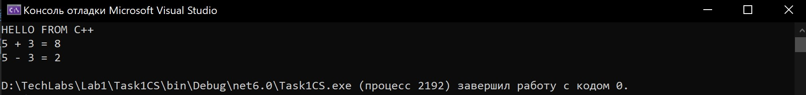

Всё прошло успешно. Мы получили ожидаемый результат.

---
## Java

Аналогичный процесс с Java происходит немного по-другому. Для этого необходимо сначала объявить необходимые нам функции на Java.

### Импорт библиотеки, написанной на C++

```java
public class CppLibrary {
    static {
        System.loadLibrary("CppLibrary");
    }

    public native void hello();
    public native int sum(int a, int b);
    public native int diff(int a, int b);
}
```
Теперь, следующей командой утилита javac сгенерирует нам заголовочный файл .h

`javac -h . ./src/CppLibrary.java`

### Сгенерированный заголовочный файл

```cpp
/* DO NOT EDIT THIS FILE - it is machine generated */
#include <jni.h>
/* Header for class CppLibrary */

#ifndef _Included_CppLibrary
#define _Included_CppLibrary
#ifdef __cplusplus
extern "C" {
#endif
/*
 * Class:     CppLibrary
 * Method:    hello
 * Signature: ()V
 */
JNIEXPORT void JNICALL Java_CppLibrary_hello
  (JNIEnv *, jobject);

/*
 * Class:     CppLibrary
 * Method:    sum
 * Signature: (II)I
 */
JNIEXPORT jint JNICALL Java_CppLibrary_sum
  (JNIEnv *, jobject, jint, jint);

/*
 * Class:     CppLibrary
 * Method:    diff
 * Signature: (II)I
 */
JNIEXPORT jint JNICALL Java_CppLibrary_diff
  (JNIEnv *, jobject, jint, jint);

#ifdef __cplusplus
}
#endif
#endif
```

Теперь, имея на руках заголовочный файл, реализуем необходимые функции.

### Реализация функций

```cpp
#include "CppLibrary.h"
#include <iostream>

JNIEXPORT void JNICALL Java_CppLibrary_hello
  (JNIEnv *, jobject) {
  	std::cout << "HELLO FROM C++\n";
  }

JNIEXPORT jint JNICALL Java_CppLibrary_sum
  (JNIEnv *, jobject, jint a, jint b){
  	return a + b;
  }


JNIEXPORT jint JNICALL Java_CppLibrary_diff
  (JNIEnv *, jobject, jint a, jint b) {
  	return a - b;
  }
```

Далее скомпилируем нашу библиотеку на C++ и мы будем готовы воспользоваться ей в Java.

`g++ -c -I"%JAVA_HOME%\include" -I"%JAVA_HOME%\include\win32" CppLibrary.cpp -o CppLibrary.o`

`g++ -shared -o CppLibrary.dll CppLibrary.o -W`

### Использование библиотеки

```java
public class Main
{
    public static void main(String[] args)
    {
        var lib = new CppLibrary();

        int a = 5;
        int b = 3;

        lib.hello();
        System.out.printf("%d + %d = %d\n", a, b, lib.sum(a, b));
        System.out.printf("%d - %d = %d\n", a, b, lib.diff(a, b));
    }
}

```

### Результат работы
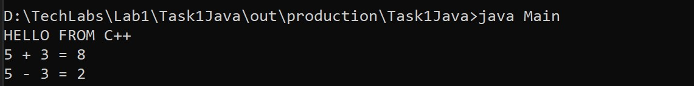

Всё также сработало успешно.

## Заключение

Интероп - очень сильный механизм, который необходимо применять с крайней осторожностью, потому что используя его мы теряем кроссплатформенность нашей программы. Соответствующую библиотеку необходимо компилировать для каждой платформы и архитектуры отдельно. Также не все типы в языках в мире .Net и JVM имеют эквивалентные типы в нативных языках, поэтому нам придется ограничиться доступными типами или создавать свои.

---
## Задание №2 (Функциональщина)

## F#

Напишем код, в котором воспользуемся функциональными фичами языка.

### Немного кода, использующего функциональные возможности языка
```fsharp
namespace SomeFunctions

module SimpleShapes =
    type Rectangle = {Width : double; Height : double}
    type Triangle = {Base : double; Height : double}
    type Circle = {Radius : double}

    type Shape =
        | Rectangle of Rectangle
        | Triangle of Triangle
        | Circle of Circle

    let Area (shape : Shape) =
        match shape with
        | Rectangle {Width = w; Height = h} -> w * h
        | Triangle {Base = w; Height = h} -> w * h / 2.
        | Circle {Radius = r} -> r ** 2. * 3.14

module ListOperations =
    let SquaredEven (start : int) (stop : int) : list<float> = 
        [start .. stop]
        |> List.where(fun c -> (c % 2) = 0)
        |> List.map(fun c -> (float c) ** 2.)

    let TripledOdd (start : int) (stop : int) : list<float> = 
        let l = [start .. stop]
        query {
            for i in l do
            where (i % 2 = 1)
            select ((float i) ** 3.)
        } |> Seq.toList
        
    let PrintSquaredEven (start : int) (stop : int) = printf "%A\n" <| SquaredEven start stop
    let PrintTripledOdd (start : int) (stop : int) = printf "%A\n" <| TripledOdd start stop

module HouseBuilder =
    type Floor =
        | SingleFloor
        | DoubleFloor
        | TripleFloor

    type Material =
        | Wood
        | Stone
        | Brick

    type Roof =
        | Wood
        | Metal
        | Tile

    type House =
        { Floor : Floor
          Material : Material
          Roof : Roof
          Chimney : bool }

    let baseHouse = 
        { Floor = DoubleFloor
          Material = Brick
          Roof = Tile
          Chimney = false }

    type HouseBuilder() =
        member _.Zero _ = baseHouse
        member _.Yield _ = baseHouse

        [<CustomOperation("floor")>]
        member _.Floor(house, floor) = { house with Floor = floor } 

        [<CustomOperation("material")>]
        member _.Material(house, material) = { house with Material = material } 

        [<CustomOperation("roof")>]
        member _.Roof(house, roof) = { house with Roof = roof }
        
        [<CustomOperation("chimney")>]
        member _.Chimney(house) = { house with Chimney = true }
```

В данном коде использованы следующие средства: pipe операторы, record классы, discriminated union, pattern matching. Также используется computation expressions на которых я написал своеобразный пример паттерна builder.

### Использование custom computation expressions
```fsharp
open SomeFunctions

let house = SomeFunctions.HouseBuilder.HouseBuilder()

printfn "%A" <| house { () }

printfn "%A" <| house{ 
                    floor SomeFunctions.HouseBuilder.SingleFloor
                    chimney
                    }
```

### Результат использования custom computation expressions
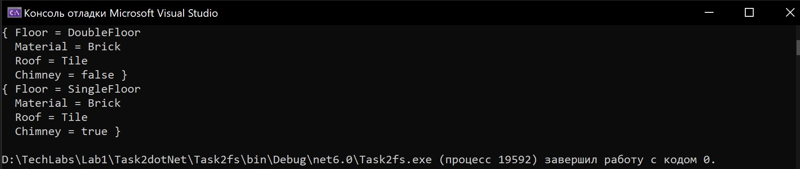

Поскольку F# и C# являются языками на единой платформе .NET и преобразуются в единый IL код, мы можем воспользоваться им в C#, однако приятные синтаксические конструкции на F# далеко не всегда превращаются во что-то красивое на C#.

### Использования кода на F# в C#
```csharp
using SomeFunctions;

namespace Task2usage;

public class Program
{
    public static void Main()
    {
        ListOperations.PrintSquaredEven(1, 100);
        ListOperations.PrintTripledOdd(1, 100);

        var triangle = new SimpleShapes.Triangle(5, 6);
        var rectangle = new SimpleShapes.Rectangle(4, 6);
        var circle = new SimpleShapes.Circle(7);

        Console.WriteLine();
        Console.WriteLine(SimpleShapes.Area(SimpleShapes.Shape.NewTriangle(triangle)));
        Console.WriteLine(SimpleShapes.Area(SimpleShapes.Shape.NewRectangle(rectangle)));
        Console.WriteLine(SimpleShapes.Area(SimpleShapes.Shape.NewCircle(circle)));

        Console.WriteLine();
        var house = new HouseBuilder.HouseBuilder();
        var baseHouse = HouseBuilder.baseHouse;
        Console.WriteLine(HouseBuilder.baseHouse);

        // House with single floor and chimney
        Console.WriteLine(house.Floor(house.Chimney(baseHouse), HouseBuilder.Floor.SingleFloor));

        // Stone house with single floor and chimney
        Console.WriteLine(
            house.Floor(
                house.Material(house.Chimney(baseHouse), HouseBuilder.Material.Stone),
                HouseBuilder.Floor.SingleFloor));
    }
```

### Результат работы
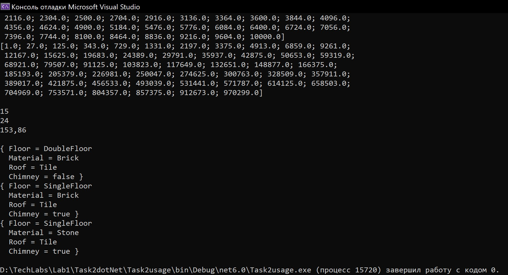

Однако мы получили результат, схожий с ожидаемым. Ниже можно посмотреть во что превращается то небольшое количество строчек на F#, если декомпилировать код в C#.

[Декомпилированный в C# код](https://pastebin.com/WP1GUazf)

## Обратим внимание на некоторые детали:

Напримере перечисления в F# количества этажей дома, мы видим в какой объёмный класс превращется пару строк.
```csharp
public sealed class Floor : IEquatable<Floor>, IStructuralEquatable, IComparable<Floor>, IComparable, IStructuralComparable
        {
            public static class Tags
            {
                public const int SingleFloor = 0;
                public const int DoubleFloor = 1;
                public const int TripleFloor = 2;
            }

            internal readonly int _tag;
            internal static readonly Floor _unique_SingleFloor = new Floor(0);
            internal static readonly Floor _unique_DoubleFloor = new Floor(1);
            internal static readonly Floor _unique_TripleFloor = new Floor(2);

            public int Tag
            {
                get
                {
                    return _tag;
                }
            }

            public static Floor SingleFloor
            {
                get
                {
                    return _unique_SingleFloor;
                }
            }
            public bool IsSingleFloor
            {
                get
                {
                    return Tag == 0;
                }
            }
            public static Floor SingleFloor
            {
                get
                {
                    return _unique_SingleFloor;
                }
            }
 
            public bool IsSingleFloor
            {
                get
                {
                    return Tag == 0;
                }
            }

            ...
```

Класс дома содержит в себе классы "перечислений" составных частей.
```csharp
public sealed class House : IEquatable<House>, IStructuralEquatable, IComparable<House>, IComparable, IStructuralComparable
        {
            internal Floor Floor@;
            internal Material Material@;
            internal Roof Roof@;
            internal bool Chimney@;
            public Floor Floor
            {
                get
                {
                    return Floor@;
                }
            }
            public Material Material
            {
                get
                {
                    return Material@;
                }
            }
            public Roof Roof
            {
                get
                {
                    return Roof@;
                }
            }
            public bool Chimney
            {
                get
                {
                    return Chimney@;
                }
            }
 
            public House(Floor floor, Material material, Roof roof, bool chimney)
            {
                Floor@ = floor;
                Material@ = material;
                Roof@ = roof;
                Chimney@ = chimney;
            }
```

Строитель дома соберётся в нечто подобное.
```csharp
 public class HouseBuilder
        {
            public House Zero<b>(b _arg1)
            {
                return baseHouse;
            }
 
            public House Yield<a>(a _arg2)
            {
                return baseHouse;
            }
 
            [CustomOperation("floor")]
            public House Floor(House house, Floor floor)
            {
                return new House(floor, house.Material@, house.Roof@, house.Chimney@);
            }
 
            [CustomOperation("material")]
            public House Material(House house, Material material)
            {
                return new House(house.Floor@, material, house.Roof@, house.Chimney@);
            }
 
            [CustomOperation("roof")]
            public House Roof(House house, Roof roof)
            {
                return new House(house.Floor@, house.Material@, roof, house.Chimney@);
            }
 
            [CustomOperation("chimney")]
            public House Chimney(House house)
            {
                return new House(house.Floor@, house.Material@, house.Roof@, true);
            }
        }
```

Pipe операторы превращаются в два класса. Вызов метода SqaredEven одним выражением сосздает список чисел диапозона, применяя к ним операции из обоих классов.
```csharp
    public static class ListOperations
    {
        internal sealed class SquaredEven@23 : FSharpFunc<int, double>
        {
            internal static readonly SquaredEven@23 @_instance = new SquaredEven@23();
 
            [CompilerGenerated]
            [DebuggerNonUserCode]
            internal SquaredEven@23()
            {
            }
 
            public override double Invoke(int c)
            {
                return Math.Pow(c, 2.0);
            }
        }

        internal sealed class SquaredEven@22-1 : FSharpFunc<int, bool>
        {
            internal static readonly SquaredEven@22-1 @_instance = new SquaredEven@22-1();
 
            [CompilerGenerated]
            [DebuggerNonUserCode]
            internal SquaredEven@22-1()
            {
            }
 
            public override bool Invoke(int c)
            {
                return c % 2 == 0;
            }
        }

    public static FSharpList<double> SquaredEven(int start, int stop)
        {
            return ListModule.Map(SquaredEven@23.@_instance, ListModule.Where(SquaredEven@22-1.@_instance, SeqModule.ToList(Operators.CreateSequence(Operators.OperatorIntrinsics.RangeInt32(start, 1, stop)))));
```

Классы (record) преобразуются в подобные классы, реализующие множество интерфейсов.
```csharp
public sealed class Rectangle : IEquatable<Rectangle>, IStructuralEquatable, IComparable<Rectangle>, IComparable, IStructuralComparable
        {
            [DebuggerBrowsable(DebuggerBrowsableState.Never)]
            internal double Width@;
 
            [DebuggerBrowsable(DebuggerBrowsableState.Never)]
            internal double Height@;
```

Discriminated union преварщается в абстрактный класс, кторые содержит в себе классы фигур, наследующие абстрактный класс. Поэтому для вызова Area у Shape необходимо создать Shape Rectangle (например), создав отдельный Rectangle и вызвав метод у класса Shape NewRectangle создадим экзампляр класса Rectangle, вложенного в класс Shape.

```csharp
public abstract class Shape : IEquatable<Shape>, IStructuralEquatable, IComparable<Shape>, IComparable, IStructuralComparable
        {
            public static class Tags
            {
                public const int Rectangle = 0;
 
                public const int Triangle = 1;
 
                public const int Circle = 2;
            }
 
            [Serializable]
            [SpecialName]
            [DebuggerTypeProxy(typeof(Rectangle@DebugTypeProxy))]
            [DebuggerDisplay("{__DebugDisplay(),nq}")]
            public class Rectangle : Shape
            {
                [DebuggerBrowsable(DebuggerBrowsableState.Never)]
                [CompilerGenerated]
                [DebuggerNonUserCode]
                internal readonly SimpleShapes.Rectangle item;
 
                [CompilationMapping(SourceConstructFlags.Field, 0, 0)]
                [CompilerGenerated]
                [DebuggerNonUserCode]
                public SimpleShapes.Rectangle Item
                {
                    [CompilerGenerated]
                    [DebuggerNonUserCode]
                    get
                    {
                        return item;
                    }
                }
            public static double Area(Shape shape)
            {
                if (!(shape is Shape.Triangle))
                {
                    if (!(shape is Shape.Circle))
                    {
                        Shape.Rectangle rectangle = (Shape.Rectangle)shape;
                        return rectangle.item.Width@ * rectangle.item.Height@;
                    }
                    Shape.Circle circle = (Shape.Circle)shape;
                    return Math.Pow(circle.item.Radius@, 2.0) * 3.14;
                }
                Shape.Triangle triangle = (Shape.Triangle)shape;
                return triangle.item.Base@ * triangle.item.Height@ / 2.0;
        }
    
 
```
---

## Scala

Аналогичные действия проделаем с Scala -> Java.

### Немного кода, использующего функциональные возможности языка
```scala
import scala.annotation.tailrec
import scala.util.chaining.scalaUtilChainingOps

package SomeFunctions {
  object SomeFunc {
    @tailrec
    final def listSum(list: List[Int], cur_sum: Long = 0L):
    Long = {
      if (list.isEmpty) cur_sum
      else listSum(list.tail, cur_sum + list.head)
    }

    def getPairsWithSum(maxInt: Int, requiredSum: Int) =
      for (i <- 0 until maxInt + 1;
           j <- 0 until maxInt + 1 if (i + j == requiredSum))
        yield(i, j)

    private def double(x: Int) = x * 2

    def double3TimesAndViewSteps(x : Int): Int = {
      println(s"Start doubling x = $x")
      x.pipe(double)
        .tap(res => println(s"After 1 double: $res"))
        .pipe(double)
        .tap(res => println(s"After 2 double: $res"))
        .pipe(double)
        .tap(res => println(s"After 3 double: $res"))
    }
  }

  object SimpleShapes {
    trait Shape
    case class Rectangle(Height : Double, Width : Double) extends Shape
    case class Triangle(Base: Double, Height : Double) extends Shape
    case class Circle(Radius : Double) extends Shape

    def Area(shape: Shape): Double = {
      shape match {
        case Rectangle(h, w) => h * w
        case Triangle(b, h) => b * h / 2.0
        case Circle(r) => 3.14 * r * r
      }
    }
  }
}
```

В данном коде используются следующие механизмы: for-comprehensions, case классы (аналог discriminated union), pattern matching, pipe операторы, хвостовая рекурсия. Поскольку Java и Scala являются языками из мира JVM, мы также можем пользоваться Scala в Java. 

### Использование кода на Scala в Java
```java
import SomeFunctions.SomeFunc;
import SomeFunctions.SimpleShapes;
import scala.collection.JavaConverters;
import java.util.ArrayList;

public class Main {
    public static void main(String[] args) {
        var list = new ArrayList<>();
        for (int i = 0; i <= 10000000; i++) list.add(i);

        System.out.printf(
                "Sum of big int list = %d\n",
                SomeFunc.listSum(JavaConverters.asScalaBuffer(list).toList(), 0));

        System.out.printf(
                "Area of rectangle with height = 5 and width = 6 is %f\n",
                SimpleShapes.Area(new SimpleShapes.Rectangle(5, 6)));

        System.out.printf(
                "Area of triangle with base = 5 and height = 6 is %f\n",
                SimpleShapes.Area(new SimpleShapes.Triangle(5, 6)));

        System.out.printf(
                "Area of circle with radius = 5 is %f\n",
                SimpleShapes.Area(new SimpleShapes.Circle(5)));

        System.out.println("\nAll pairs with int 0..7 with sum = 9");
        System.out.println(SomeFunc.getPairsWithSum(7, 9));

        int x = SomeFunc.double3TimesAndViewSteps(6);
        System.out.printf("\nFinal result x = %d", x);
    }
}
```

### Результат работы
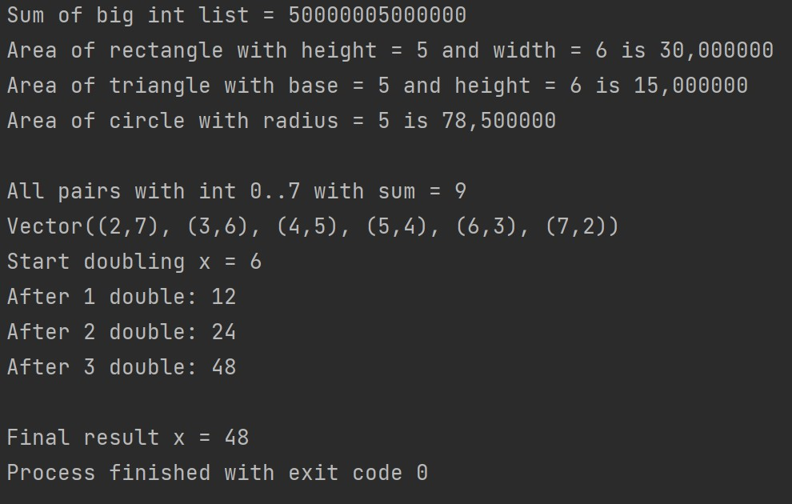

Мы получили ожидаемый результат. Ниже можно посмотреть во что превращается Scala при декомпиляции в Java.

[Декомпилированный в Java код](https://pastebin.com/u/jaba_jabila/1/WXvKVjTi)

## Обратим внимание на некоторые детали:

На примере класса прямоугольника рассмотрим во что он превращается.
```java
public static class Rectangle implements SimpleShapes.Shape, Product, Serializable
{
    private final double Height;
    private final double Width;
    
    ...

public static class Rectangle$ extends AbstractFunction2<Object, Object, SimpleShapes.Rectangle> implements Serializable
{
    public static final Rectangle$ MODULE$;
    
    static {
        Rectangle$.MODULE$ = new Rectangle$();
    }
    
    public final String toString() {
        return "Rectangle";
    }
    
    public SimpleShapes.Rectangle apply(final double Height, final double Width) {
        return new SimpleShapes.Rectangle(Height, Width);
    }
    
    public Option<Tuple2<Object, Object>> unapply(final SimpleShapes.Rectangle x$0) {
        return (Option<Tuple2<Object, Object>>)((x$0 == null) ? None$.MODULE$ : new Some((Object)new Tuple2$mcDD$sp(x$0.Height(), x$0.Width())));
    }
    
    private Object writeReplace() {
        return new ModuleSerializationProxy((Class)Rectangle$.class);
    }
}
```
Классы фигур реализуют сгенерированный интерфейс для всех фигур.

Таким образом выглядит train (аналог DU) и pattern matching. 
```java
public final class SimpleShapes
{
    public static double Area(final SimpleShapes.Shape shape) {
        return SimpleShapes$.MODULE$.Area(shape);
    }
    
    public static class Rectangle implements SimpleShapes.Shape, Product, Serializable
    {
        private final double Height;
        private final double Width;
        
        public Iterator<String> productElementNames() {
            return (Iterator<String>)Product.productElementNames$((Product)this);
        }
        
        public double Height() {
            return this.Height;
        }
        
        public double Width() {
            return this.Width;
        }
    ...

public final class SimpleShapes$
{
    public static final SimpleShapes$ MODULE$;
    
    static {
        MODULE$ = new SimpleShapes$();
    }
    
    public double Area(final SimpleShapes.Shape shape) {
        double n;
        if (shape instanceof SimpleShapes.Rectangle) {
            final SimpleShapes.Rectangle rectangle = (SimpleShapes.Rectangle)shape;
            final double h = rectangle.Height();
            final double w = rectangle.Width();
            n = h * w;
        }
        else if (shape instanceof SimpleShapes.Triangle) {
            final SimpleShapes.Triangle triangle = (SimpleShapes.Triangle)shape;
            final double b = triangle.Base();
            final double h2 = triangle.Height();
            n = b * h2 / 2.0;
        }
        else {
            if (!(shape instanceof SimpleShapes.Circle)) {
                throw new MatchError((Object)shape);
            }
            final double r = ((SimpleShapes.Circle)shape).Radius();
            n = 3.14 * r * r;
        }
        return n;
    }
    
    private SimpleShapes$() {
    }
}
```

На примере следующего кода видно, что хвостовая рекурсия превращается в нерекурсивный метод; pipe и tap операторы просто ипортируются из библиотеки scala и превращаеются в громоздкую конструкцию.
```java
public final class SomeFunc$
{
    public static final SomeFunc$ MODULE$;
    
    static {
        MODULE$ = new SomeFunc$();
    }
    
    public final long listSum(final List<Object> list, final long cur_sum) {
        while (!list.isEmpty()) {
            final List list2 = (List)list.tail();
            cur_sum += BoxesRunTime.unboxToInt(list.head());
            list = list2;
        }
        return cur_sum;
    }
    
    public final long listSum$default$2() {
        return 0L;
    }
    
    public IndexedSeq<Tuple2<Object, Object>> getPairsWithSum(final int maxInt, final int requiredSum) {
        return (IndexedSeq<Tuple2<Object, Object>>)RichInt$.MODULE$.until$extension(Predef$.MODULE$.intWrapper(0), maxInt + 1).flatMap(i -> $anonfun$getPairsWithSum$1(maxInt, requiredSum, BoxesRunTime.unboxToInt(i)));
    }
    
    private int double(final int x) {
        return x * 2;
    }
    
    public int double3TimesAndViewSteps(final int x) {
        Predef$.MODULE$.println((Object)new StringBuilder(19).append("Start doubling x = ").append(x).toString());
        return BoxesRunTime.unboxToInt(ChainingOps$.MODULE$.tap$extension(package.chaining$.MODULE$.scalaUtilChainingOps(ChainingOps$.MODULE$.pipe$extension(package.chaining$.MODULE$.scalaUtilChainingOps(ChainingOps$.MODULE$.tap$extension(package.chaining$.MODULE$.scalaUtilChainingOps(ChainingOps$.MODULE$.pipe$extension(package.chaining$.MODULE$.scalaUtilChainingOps(ChainingOps$.MODULE$.tap$extension(package.chaining$.MODULE$.scalaUtilChainingOps(ChainingOps$.MODULE$.pipe$extension(package.chaining$.MODULE$.scalaUtilChainingOps((Object)BoxesRunTime.boxToInteger(x)), (Function1)(x -> SomeFunc$.MODULE$.double(x)))), (Function1)(res -> Predef$.MODULE$.println((Object)new StringBuilder(16).append("After 1 double: ").append(res).toString())))), (Function1)(x -> SomeFunc$.MODULE$.double(x)))), (Function1)(res -> Predef$.MODULE$.println((Object)new StringBuilder(16).append("After 2 double: ").append(res).toString())))), (Function1)(x -> SomeFunc$.MODULE$.double(x)))), (Function1)(res -> Predef$.MODULE$.println((Object)new StringBuilder(16).append("After 3 double: ").append(res).toString()))));
    }
    
    public static final /* synthetic */ Tuple2 $anonfun$getPairsWithSum$3(final int i$1, final int j) {
        return (Tuple2)new Tuple2$mcII$sp(i$1, j);
    }
    
    public static final /* synthetic */ IndexedSeq $anonfun$getPairsWithSum$1(final int maxInt$1, final int requiredSum$1, final int i) {
        return (IndexedSeq)RichInt$.MODULE$.until$extension(Predef$.MODULE$.intWrapper(0), maxInt$1 + 1).withFilter((Function1)(j -> i + j == requiredSum$1)).map(j -> $anonfun$getPairsWithSum$3(i, BoxesRunTime.unboxToInt(j)));
    }
    
    private SomeFunc$() {
    }
}
```

## Заключение

Поскольку .NET и JVM позволяют нескольким, на первый взгляд даже не похожим языкам, взаимодействовать друг с другом, поскольку программный код компилируется в единый байт-код (JVM) b IL-код(.NET).

---

## Задание №3 (Пакетные менеджеры)

В данном задании познакомимся с пакетными менеджерами в .NET и Java мирах.

## .NET

Создадим проект, в котором напишем простенький граф и алгоритмы прохода по нему (bfs и dfs)

### Класс ориентированной вершины
```csharp
namespace SimpleGraphDotNET.DirectedGraph;

public class DirectedVertex<T>
{
    private readonly List<DirectedVertex<T>> _children;

    public DirectedVertex(T vertexValue)
    {
        VertexValue = vertexValue; 
        _children = new List<DirectedVertex<T>>();
    }

    public T VertexValue { get; set; }
    public IReadOnlyCollection<DirectedVertex<T>> Children => _children;

    public DirectedVertex<T> AddChild(DirectedVertex<T> vertex)
    {
        if (vertex == null) throw new ArgumentNullException(nameof(vertex));
        if (_children.Contains(vertex)) return this;
        _children.Add(vertex);
        return this;
    }
}
```

### Класс ориентированного графа
```csharp
namespace SimpleGraphDotNET.DirectedGraph;

public class DirectedVertex<T>
{
    private readonly List<DirectedVertex<T>> _children;

    public DirectedVertex(T vertexValue)
    {
        VertexValue = vertexValue; 
        _children = new List<DirectedVertex<T>>();
    }

    public T VertexValue { get; set; }
    public IReadOnlyCollection<DirectedVertex<T>> Children => _children;

    public DirectedVertex<T> AddChild(DirectedVertex<T> vertex)
    {
        if (vertex == null) throw new ArgumentNullException(nameof(vertex));
        if (_children.Contains(vertex)) return this;
        _children.Add(vertex);
        return this;
    }
}
```

Для .NET механизмом совместного использования кода, поддерживаемым Майкрософт, является NuGet, который определяет, как создаются, размещаются и используются пакеты. Пакет NuGet представляет собой ZIP-файл с расширением .nupkg, который содержит скомпилированный код, другие файлы, связанные с этим кодом, и описательный манифест, включающий общие сведения о пакете (версия, название и т.д.). Разработчики, у которых есть код, создают пакеты и публикуют их на закрытых или открытых узлах. Потребители получают эти пакеты из соответствующих узлов, добавляют их в свои проекты, а затем вызывают функции пакета в коде своего проекта. При этом NuGet сам обрабатывает все промежуточные данные. При этом, если некоторые пакеты зависят от других пакетов, нам нужно заботиться только о тех пакетах, которые вы используете непосредственно в проекте. Все остальные зависимости обрабатывает NuGet.

Для создания пакета необходимо написать рабочий проект. В IDE Visual Studio можно поставить галочку, чтобы nuget создавался при сборке. Также можно указать метаинформацию о пакете (название, версия, авторы и др.)

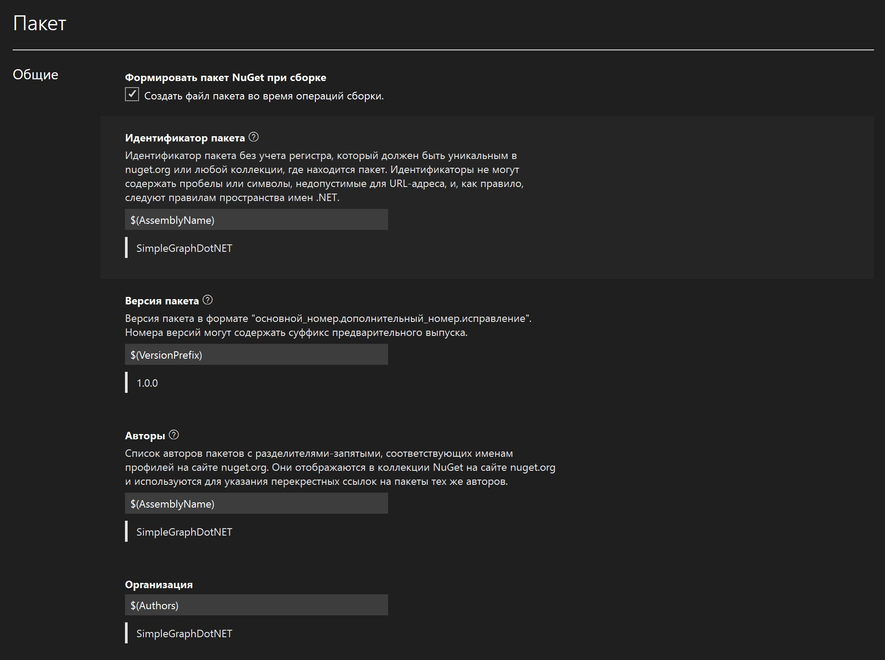

Создадим другой проект, в котором воспользуемся наши м nuget-ом. Для импорта пакета в настройках пакетного менеджера в Visual Studio укажем путь к нашему пакету. Теперь мы можем добавить его в проект и воспользоваться им.

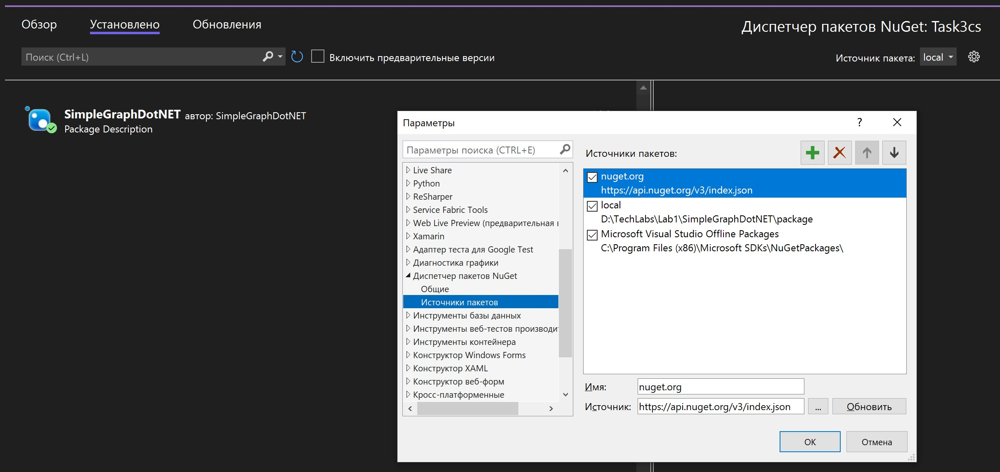

### Использование пакета в другом проекте на C#
```csharp
using SimpleGraphDotNET.DirectedGraph;

namespace Task3cs;
internal class Program
{
    internal static void Main()
    {
        var a = new DirectedVertex<int>(1);
        var b = new DirectedVertex<int>(2);
        var c = new DirectedVertex<int>(3);
        var d = new DirectedVertex<int>(4);
        var e = new DirectedVertex<int>(5);

        a.AddChild(b);
        b.AddChild(c);
        a.AddChild(d);
        b.AddChild(e);
        d.AddChild(e);

        var graph = new SimpleDirectedGraph<int>()
            .AddNode(a)
            .AddNode(b)
            .AddNode(c)
            .AddNode(d)
            .AddNode(e);

        graph.Dfs(a);
        graph.Bfs(a);
    }
}
```

### Результат работы
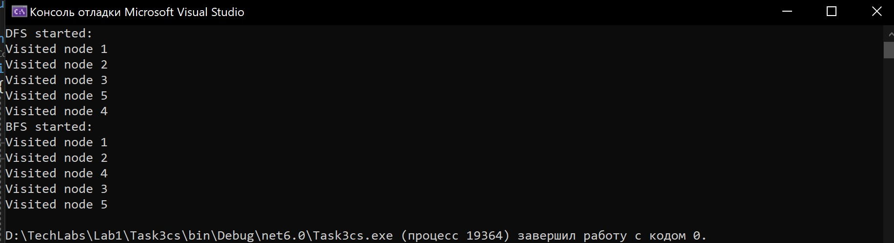

### Использование пакета в другом проекте на F#
```fsharp
open SimpleGraphDotNET.DirectedGraph

let addChild (child: DirectedVertex<int>) (parent : DirectedVertex<int>) =
    parent.AddChild(child)

let addNode (node : DirectedVertex<int>) (graph : SimpleDirectedGraph<int>) =
    graph.AddNode(node)


let e = DirectedVertex<int> 5
let d = DirectedVertex<int> 4 |> addChild e
let c = DirectedVertex<int> 3
let b = DirectedVertex<int> 2 |> addChild c |> addChild e
let a = DirectedVertex<int> 1 |> addChild b |> addChild d


let graph = SimpleDirectedGraph<int>() |> addNode a |> addNode b |> addNode c |> addNode d |> addNode e

graph.Dfs(a);
graph.Bfs(a);
```

### Результат работы
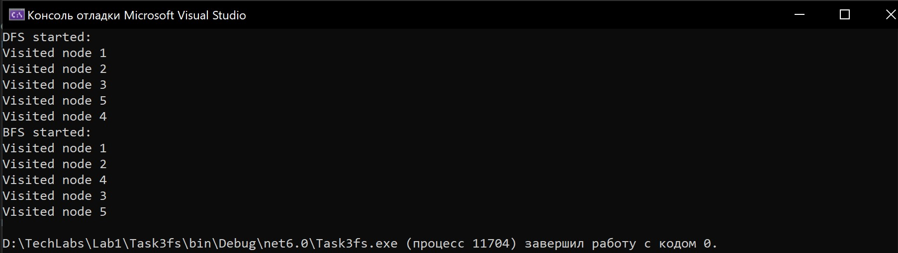

Мы успешно воспользовались своим пакетом в другом проекте на двух разных языках и получили одинаковые верные результаты.

---

## JVM

Рассмотрим на примере Maven. Maven - не просто пакетный менеджер, это целый фреймворк для сборки проектов. Maven заставляет нас придерживаться следующей организации файлов в проекте:
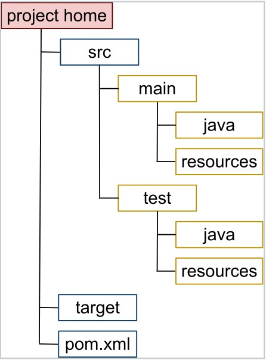

Информация для сборки проекта Maven содержится в файле с названием pom.xml. При запуске Maven проверяет конфигурационный файл на наличие всех необходимых данных.
Минимальная конфигурация проекта включает версию конфигурационного файла, имя проекта, его автора и версию.
В файле pom.xml также задаются зависимости от других проектов. Менеджер зависимостей Maven ищет необходимые файлы в локальных каталогах или в локальном maven-репозитории. Если зависимость не находится локально, Maven подключается к maven-репозиторию в сети и копирует в локальный репозиторий. По умолчанию Maven использует Maven Central Repository. Транзитивные зависимости от других библиотек и проектов подключаются автоматически.

Создадим аналогичные классы для графа.

### Класс ориентированной вершины
```java
import java.util.ArrayList;
import java.util.List;

public class DirectedVertex<T>
{
    private final List<DirectedVertex<T>> _children;
    public T value;

    public DirectedVertex(T vertexValue)
    {
        value = vertexValue;
        _children = new ArrayList();
    }

    public List<DirectedVertex<T>> getChildren()
    {
        return new ArrayList(_children);
    }

    public DirectedVertex<T> addChild(DirectedVertex<T> vertex)
    {
        if (vertex == null) throw new IllegalArgumentException("Vertex can't be null!");
        if (_children.contains(vertex)) return this;
        _children.add(vertex);
        return this;
    }
}
```

### Класс ориентированного графа
```java
import java.util.ArrayDeque;
import java.util.ArrayList;
import java.util.List;

public class SimpleDirectedGraph<T>
{
    private final List<DirectedVertex<T>> _nodes = new ArrayList();

    public SimpleDirectedGraph() {}

    public SimpleDirectedGraph(List<DirectedVertex<T>> vertexes)
    {
        if (vertexes == null) throw new IllegalArgumentException("Vertex list can't be null");
        for (var vertex : vertexes)
        {
            addNode(vertex);
        }
    }

    public List<DirectedVertex<T>> getNodes()
    {
        return new ArrayList(_nodes);
    }

    public SimpleDirectedGraph<T> addNode(DirectedVertex<T> newNode)
    {
        if (newNode == null) throw new IllegalArgumentException("NewNode can't be null!");
        if (!_nodes.contains(newNode)) _nodes.add(newNode);
        return this;
    }

    public void removeNode(DirectedVertex<T> node)
    {
        _nodes.remove(node);
    }

    public void dfs(DirectedVertex<T> startVertex) {
        System.out.println("DFS started:");
        if (startVertex == null) throw new IllegalArgumentException("StartVertex can't be null!");
        boolean[] visited = new boolean[_nodes.size()];
        dfsWalk(startVertex, visited);
    }

    public void bfs(DirectedVertex<T> startVertex) {
        System.out.println("BFS started:");
        if (startVertex == null) throw new IllegalArgumentException("StartVertex can't be null!");
        boolean[] visited = new boolean[_nodes.size()];
        ArrayDeque<DirectedVertex<T>> queue = new ArrayDeque();
        queue.addLast(startVertex);

        while(!queue.isEmpty())
        {
            var vertex = queue.pollFirst();
            int index = _nodes.indexOf(vertex);
            if (index == -1 || visited[index]) continue;
            visited[index] = true;
            System.out.printf("Visited node %s\n", vertex.value.toString());

            for (var child : vertex.getChildren())
            {
                int ind = _nodes.indexOf(child);
                if (ind != -1 && !visited[ind])
                    queue.addLast(child);
            }
        }
    }

    private void dfsWalk(DirectedVertex<T> vertex, boolean[] visited) {
        int index = _nodes.indexOf(vertex);
        if (index == -1) return;
        visited[index] = true;
        System.out.printf("Visited node %s\n", vertex.value.toString());

        for (var child : vertex.getChildren())
        {
            int ind = _nodes.indexOf(child);
            if (ind != -1 && !visited[ind])
                dfsWalk(child, visited);
        }
    }
}
```

Теперь настроим информацию о проекте в файле pom.xml и соберём проект.

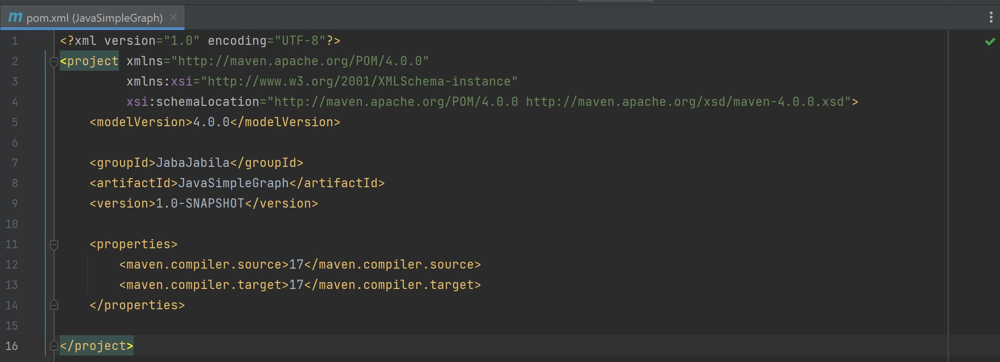

Теперь создадим другой проект на Maven и соответствующем pom.xml файле добавим зависимость на проект с графом. Теперь мы готовы к использованию нашего графа в другом проекте на двух разных языках.

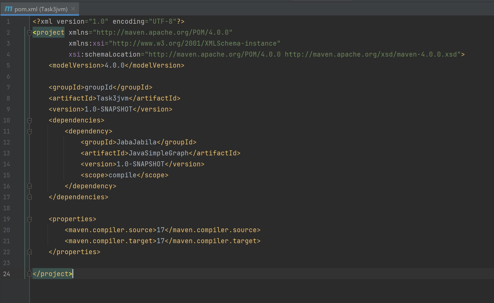

### Использование пакета в другом проекте на Java
```java
public class MainJava {
    public static void main(String[] args)
    {
        var a = new DirectedVertex<Integer>(1);
        var b = new DirectedVertex<Integer>(2);
        var c = new DirectedVertex<Integer>(3);
        var d = new DirectedVertex<Integer>(4);
        var e = new DirectedVertex<Integer>(5);

        a.addChild(b);
        b.addChild(c);
        a.addChild(d);
        b.addChild(e);
        d.addChild(e);

        SimpleDirectedGraph<Integer> graph = new SimpleDirectedGraph<Integer>()
                .addNode(a)
                .addNode(b)
                .addNode(c)
                .addNode(d)
                .addNode(e);

        graph.dfs(a);
        graph.bfs(a);
    }
}

```

### Результат работы
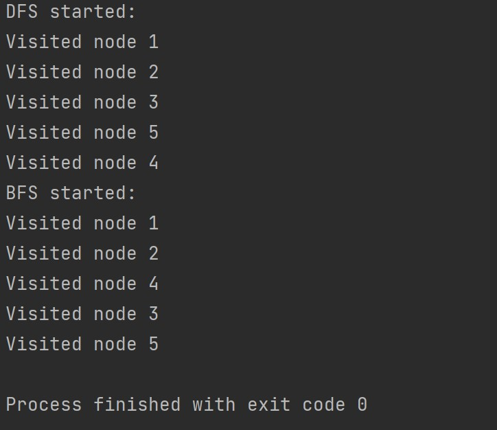

### Использование пакета в другом проекте на Kotlin
```kotlin
fun main()
{
    val a = DirectedVertex(1)
    val b = DirectedVertex(2)
    val c = DirectedVertex(3)
    val d = DirectedVertex(4)
    val e = DirectedVertex(5)

    a.addChild(b)
    b.addChild(c)
    a.addChild(d)
    b.addChild(e)
    d.addChild(e)

    val graph = SimpleDirectedGraph<Int>()
        .addNode(a)
        .addNode(b)
        .addNode(c)
        .addNode(d)
        .addNode(e)

    graph.dfs(a)
    graph.bfs(a)
}
```

### Результат работы
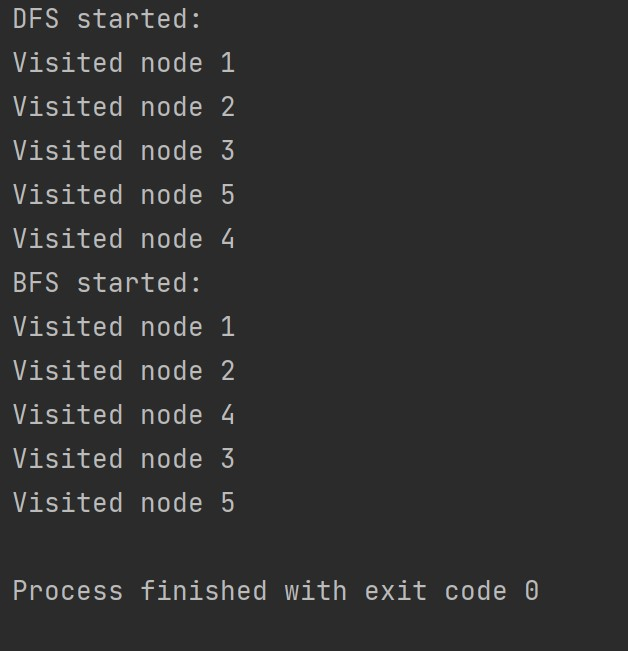

Получили также одинаковые верные результаты.

## Заключение

Пакетные менеджеры в Java и .NET сильно облегчают работу с внешними зависимостями от других проектов/фреймворках/библиотек, которые могут быть написаны в любое время другими разработчиками, а средства IDE ещё сильнее облегчают нам жизнь.

---

## Задание №4 (Бэнчмаркинг)

Языки программирования содержат арсенал, которым можно воспользоваться для оценки эффективности алгоритмов по времени и аллоциоравнной памяти. Такой анализ алгоритмов называется "бэнчмаркинг".

## C#

Возьмём несколько стандартных алгоритмов сортировок.

### Bubble sort
```csharp
namespace Task4cs.SortAlgorithms;

public class BubbleSort
{
    public static void Sort(int[] array)
    {
        for (int i = 0; i < array.Length - 1; i++)
        for (int j = 0; j < array.Length - i - 1; j++)
            if (array[j] > array[j + 1])
            {
                (array[j], array[j + 1]) = (array[j + 1], array[j]);
            }
                        
    }
}
```

### Merge sort
```csharp
namespace Task4cs.SortAlgorithms;

public class MergeSort
{
    public static void Sort(int[] array)
    {
        MergeSortStep(array, 0, array.Length - 1);
    }

    private static void Merge(int[] array, int minIndex, int middleIndex, int maxIndex)
    {
        int left = minIndex;
        int right = middleIndex + 1;
        var temp = new int[maxIndex - minIndex + 1];
        int ind = 0;

        while (left <= middleIndex && right <= maxIndex)
        {
            if (array[left] < array[right])
            {
                temp[ind] = array[left];
                left++;
            }
            else
            {
                temp[ind] = array[right];
                right++;
            }
            ind++;
        }

        for (var i = right; i <= maxIndex; i++)
        {
            temp[ind] = array[i];
            ind++;
        }

        for (var i = left; i <= middleIndex; i++)
        {
            temp[ind] = array[i];
            ind++;
        }

        for (var i = 0; i < temp.Length; i++)
            array[minIndex + i] = temp[i];
    }

    private static int[] MergeSortStep(int[] array, int minIndex, int maxIndex)
    {
        if (minIndex >= maxIndex) return array;
        var middleIndex = (minIndex + maxIndex) / 2;
        MergeSortStep(array, minIndex, middleIndex);
        MergeSortStep(array, middleIndex + 1, maxIndex);
        Merge(array, minIndex, middleIndex, maxIndex);
        return array;
    }
}
```

### Quick sort
```csharp
namespace Task4cs.SortAlgorithms;

public class QuickSort
{
    public static void Sort(int[] array)
    {
        QuickSortStep(array, 0, array.Length - 1);
    }

    private static int SplitParts(int[] array, int minIndex, int maxIndex)
    {
        var baseEl = minIndex - 1;
        for (var i = minIndex; i < maxIndex; i++)
            if (array[i] < array[maxIndex])
            {
                baseEl++;
                (array[baseEl], array[i]) = (array[i], array[baseEl]);
            }

        baseEl++;
        (array[baseEl], array[maxIndex]) = (array[maxIndex], array[baseEl]);
        return baseEl;
    }

    private static int[] QuickSortStep(int[] array, int minIndex, int maxIndex)
    {
        if (minIndex >= maxIndex) return array;
        var pivotIndex = SplitParts(array, minIndex, maxIndex);
        QuickSortStep(array, minIndex, pivotIndex - 1);
        QuickSortStep(array, pivotIndex + 1, maxIndex);
        return array;
    }
}
```

Теперь, воспользовавшись пакетом BechmarkDotNet, напишем сценарий, прогоняющий наши сортировки (а также стандартную) несколько раз по массивам разной длинны, чтобы получить среднее время выполнения, а также размер аллоцированной памяти в куче.

### Benchmarking class
```csharp
using BenchmarkDotNet.Attributes;

namespace Task4cs.Benchmark;

[MemoryDiagnoser]
public class SortBenchmark
{
    public int[] ArrayToBenchmark { get; set; }

    [Params(1000, 5000, 10000, 50000, 100000)]
    public int Length { get; set; }

    [GlobalSetup]
    public void ArrayAlloc()
    {
        ArrayToBenchmark = new int[Length];
    }

    [IterationSetup]
    public void ArrayGen()
    {
        var rnd = new Random(Guid.NewGuid().GetHashCode());
        for (int i = 0; i < Length; i++) ArrayToBenchmark[i] = rnd.Next();
    }
        
        
    [WarmupCount(1)]
    [IterationCount(3)]
    [Benchmark]
    public void BubbleSort()
    {
        SortAlgorithms.BubbleSort.Sort(ArrayToBenchmark);
    }

    [WarmupCount(1)]
    [Benchmark]
    public void MergeSort()
    {
        SortAlgorithms.MergeSort.Sort(ArrayToBenchmark);
    }

    [WarmupCount(1)]
    [Benchmark]
    public void QuickSort()
    {
        SortAlgorithms.QuickSort.Sort(ArrayToBenchmark);
    }

    [WarmupCount(1)]
    [Benchmark]
    public void StandardSort()
    {
        Array.Sort(ArrayToBenchmark);
    }
}
```

Запустим бэнчмаркинг и дадим ему отработать.

### Запуск бэнчамаркинга
```csharp
using BenchmarkDotNet.Running;
using Task4cs.Benchmark;

namespace Task4cs;

internal class Program
{
    internal static void Main(string[] args)
    {
        var summary = BenchmarkRunner.Run<SortBenchmark>();
    }
}
```
Получим следующий результат.

### Результат бэнчмарка
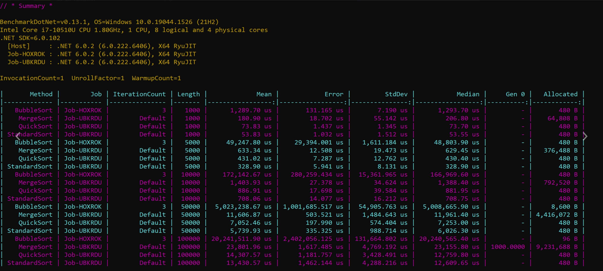

Результат совпал с ожидаемым. Bubble sort оказался крайне неэффективным по времени, Merge sort требует дополнительных аллокаций, размер которых растёт пропорционально размеру массива, Quick sort оказался немного быстрее merge sort, а стандартный алгоритм работает еще быстрее.

---

## Java

Напишем единый интерфейс для сортировок, который нам пригодиться позже.

### Sort interface
```java
package SortAlgorithms;

public interface ISort {
    void sort(int[] array);
    String getSortName();
}
```

### Wrapped standard sort
```java
package SortAlgorithms;

import java.util.Arrays;

public class StandardSort implements ISort {
    public void sort(int[] array) {
        Arrays.sort(array);
    }

    public String getSortName() {
        return "standard";
    }
}
```

### Bubble sort
```java
package SortAlgorithms;

public class BubbleSort implements ISort {
    public void sort(int[] array) {
        for (int i = 0; i < array.length - 1; i++)
            for (int j = 0; j < array.length - i - 1; j++)
                if (array[j] > array[j + 1])
                {
                    int x = array[j];
                    array[j] = array[j + 1];
                    array[j + 1] = x;
                }
    }

    public String getSortName() {
        return "bubble";
    }
}
```

### Merge sort
```csharp
package SortAlgorithms;

public class MergeSort implements ISort {
    public void sort(int[] array)
    {
        mergeSortStep(array, 0, array.length - 1);
    }

    @Override
    public String getSortName() {
        return "merge";
    }

    private static void merge(int[] array, int minIndex, int middleIndex, int maxIndex)
    {
        int left = minIndex;
        int right = middleIndex + 1;
        var temp = new int[maxIndex - minIndex + 1];
        int ind = 0;

        while (left <= middleIndex && right <= maxIndex)
        {
            if (array[left] < array[right])
            {
                temp[ind] = array[left];
                left++;
            }
            else
            {
                temp[ind] = array[right];
                right++;
            }
            ind++;
        }

        for (var i = left; i <= middleIndex; i++)
        {
            temp[ind] = array[i];
            ind++;
        }

        for (var i = right; i <= maxIndex; i++)
        {
            temp[ind] = array[i];
            ind++;
        }

        for (var i = 0; i < temp.length; i++)
            array[minIndex + i] = temp[i];
    }

    private static int[] mergeSortStep(int[] array, int minIndex, int maxIndex)
    {
        if (minIndex >= maxIndex) return array;
        var middleIndex = (minIndex + maxIndex) / 2;
        mergeSortStep(array, minIndex, middleIndex);
        mergeSortStep(array, middleIndex + 1, maxIndex);
        merge(array, minIndex, middleIndex, maxIndex);
        return array;
    }
}
```

Воспользуемся Java Microbenchmark Harness (JMH) для аналогичной оценки алгоритмы сортировок.

### Benchmarking class
```java
package benchmark;

import SortAlgorithms.BubbleSort;
import SortAlgorithms.MergeSort;
import org.openjdk.jmh.annotations.*;
import org.openjdk.jmh.infra.Blackhole;

import java.util.Arrays;
import java.util.Random;
import java.util.concurrent.TimeUnit;

public class SortBenchmark {

    @State(Scope.Benchmark)
    public static class ExecutionPlan {
        public int[] array;

        @Param({"1000", "5000", "10000", "50000", "100000"})
        public int length;

        public BubbleSort bubbleSort = new BubbleSort();
        public MergeSort mergeSort = new MergeSort();

        @Setup(Level.Iteration)
        public void generateArray() {
            Random rd = new Random();
            array = new int[length];
            for (int i = 0; i < length; i++) {
                array[i] = rd.nextInt();
            }
        }
    }

    @Benchmark
    @Fork(warmups = 0, value = 1)
    @Warmup(iterations = 1)
    @BenchmarkMode(Mode.AverageTime)
    @Measurement(iterations = 3)
    @OutputTimeUnit(TimeUnit.MICROSECONDS)
    public void bubbleSortBenchmark(ExecutionPlan plan) {
        plan.bubbleSort.sort(plan.array);
    }

    @Benchmark
    @Fork(warmups = 0, value = 1)
    @Warmup(iterations = 1)
    @BenchmarkMode(Mode.AverageTime)
    @Measurement(iterations = 10)
    @OutputTimeUnit(TimeUnit.MICROSECONDS)
    public void mergeSortBenchmark(ExecutionPlan plan, Blackhole blackhole) {
        plan.mergeSort.sort(plan.array);
        blackhole.consume(plan.array);
    }

    @Benchmark
    @Fork(warmups = 0, value = 1)
    @Warmup(iterations = 1)
    @BenchmarkMode(Mode.AverageTime)
    @Measurement(iterations = 10)
    @OutputTimeUnit(TimeUnit.MICROSECONDS)
    public void standardSortBenchmark(ExecutionPlan plan, Blackhole blackhole) {
        Arrays.sort(plan.array);
        blackhole.consume(plan.array);
    }
}
```

### Запуск бэнчамаркинга
```java
public class Main {
    public static void main(String[] args)
            throws Exception {
        org.openjdk.jmh.Main.main(args);
    }
}
```

### Результат бэнчмарка
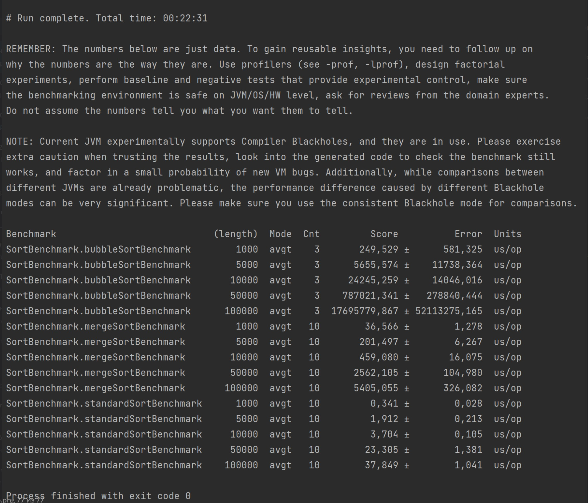

Результат работы не оправдал ожидания. Мало того, что jmh не позволяет оценить размеры доп. аллокаций, мы получили аномально быстрые результаты для стандартного алгоритма.

Мной было принято решение попытаться самому померить время работы и аллокации на куче. Для этого я замерял время и размер кучи до и после прогона алгоритма. С измерением аллокаций возникали некоторые проблемы, не всегда удавалось получить реальный результат (вероятнее всего по причине работы сборщика мусора), поэтому при подсчёте среднего размера аллокаций я не учитывал результаты <= 0.

### Моя попытка написать бэнчамаркинг
```java
package benchmark;

import SortAlgorithms.ISort;
import java.lang.management.ManagementFactory;
import java.lang.management.MemoryMXBean;
import java.util.Random;

public class MySortBenchmark {

    public int[] array;
    MemoryMXBean memoryMXBean = ManagementFactory.getMemoryMXBean();

    public void mySortBenchmark(ISort sortAlgo, int warmups, int iterations, int arraySize) {

        long[] res_t = new long[iterations];
        long[] res_mem = new long[iterations];
        array = new int[arraySize];

        // WARMING UP
        for (int i = 0; i < warmups; i++) {
            generateArray(arraySize);
            sortAlgo.sort(array);
        }

        // BENCHMARKING
        for (int i = 0; i < iterations; i++) {
            generateArray(arraySize);
            long mem_before = memoryMXBean.getHeapMemoryUsage().getUsed();
            long start_t = System.nanoTime();
            sortAlgo.sort(array);
            long end_t = System.nanoTime();
            long mem_after = memoryMXBean.getHeapMemoryUsage().getUsed();
            long diff_t = end_t - start_t;
            long diff_mem = mem_after - mem_before;
            System.out.printf("iter #%d: %s sort for int[%d] took %d nanoseconds\n",
                    i + 1, sortAlgo.getSortName(), arraySize, diff_t);

            res_t[i] = diff_t;
            res_mem[i] = diff_mem;
        }

        long mean_t = 0;
        long mean_mem = 0;
        int non_null_iters = iterations;
        for (int i = 0; i < iterations; i++) {
            mean_t += res_t[i];

            if (res_mem[i] <= 0) {
                non_null_iters--;
            }
            else {
                mean_mem += res_mem[i];
            }

        }

        mean_mem = mean_mem == 0 ? 0 : mean_mem / non_null_iters;

        // ESTIMATING MEAN
        System.out.printf(">> Mean for %s sort (int[%d]) = %.3f nanoseconds | allocated : %d bytes \n\n",
                sortAlgo.getSortName(), arraySize, (float)mean_t / iterations, mean_mem);
    }

    private void generateArray(int n) {
        Random rd = new Random();
        for (int i = 0; i < n; i++) {
            array[i] = rd.nextInt();
        }
    }
}

```
 ### Запуск
```java
import SortAlgorithms.BubbleSort;
import SortAlgorithms.MergeSort;
import SortAlgorithms.StandardSort;
import benchmark.MySortBenchmark;

public class Main {
    public static void main(String[] args)
    {
        var bench = new MySortBenchmark();
        int[] sizes = {1000, 5000, 10000, 50000, 100000};
        var standard = new StandardSort();
        var merge = new MergeSort();
        var bubble = new BubbleSort();

        for (int s : sizes) {
            bench.mySortBenchmark(bubble, 1, 10, s);
            bench.mySortBenchmark(merge, 1, 10, s);
            bench.mySortBenchmark(standard, 1, 10, s);
            System.out.println("---------------------------------------------\n");
        }
    }
}
```

### Результат моего псевдо бэнчмарка
| Algorithm     | Array length | Mean (ns)  | Allocated (bytes) |
|---------------|--------------|------------|-------------------|
| Bubble sort   | 1000         | 1690430    | 0                 |
| Bubble sort   | 5000         | 34717340   | 0                 |
| Bubble sort   | 10000        | 164859408  | 2097152           |
| Bubble sort   | 50000        | 3987200768 | 0                 |
| Bubble sort   | 100000       | 15576823808| 0                 |
| Standard sort | 1000         | 51970      | 0                 |
| Standard sort | 5000         | 705830     | 0                 |
| Standard sort | 10000        | 2348690    | 0                 |
| Standard sort | 50000        | 8169430.5  | 0                 |
| Standard sort | 100000       | 10783600   | 0                 |
| Merge sort    | 1000         | 392220     | 209715            |
| Merge sort    | 5000         | 740360     | 209715            |
| Merge sort    | 10000        | 1867330    | 209715            |
| Merge sort    | 50000        | 7270120    | 3961287           |
| Merge sort    | 100000       | 15176170   | 8388608           |
--- 

Результат уже больше похож на правду.

## Заключение

.NET предоставляет удобную утилиту для бэнчмаркинга, в отличие от Java, где пришлось своими руками колдовать псевдо-бэнчмаркинг. Возможно мне стоило воспользоваться средствами профайлинга для Java, но ещё больше времени тратить на данное задание я не стал.

## Задание №5 (Профайлинг)

Чтобы очень детально изучить работу написанного кода, выявлять места, снижающие производительность и в целом оценить эффективность решения, используются программы-профилирощики (профайлинги). Для .NET существуют такие профилировщики как dotTrace т dotMemory.

Создадим сценарий, при котором будут создаваться Restore Points для 10 файлов, размерами (8-40 Кб). Эти файлы будут периодически добавляться и удаляться из списка Job object. Дальше будет происходить восстановление последнего Restore point-а и удаление всех Restore point-ов. Также стоит ограничение на максимальное число Resore point-ов (8), чтобы чаще отрабатывал процесс их удаления. Процесс повторяется в бесконечном цикле, чтобы можно было проще отслеживать работу в реальном времени и делать Snapshot-ы текущего состояния работы. Сначала процесс проделываем на файловом хранилище Restore point-ов, затем проверим работу In Memory хранилища.

### Сценарий использования бэкапов в цикле.
```csharp
using System.Linq;
using Backups.Algorithms;
using Backups.Entities;
using BackupsExtra.Algorithms;
using BackupsExtra.Controllers;
using BackupsExtra.Loggers;
using BackupsExtra.Wrappers.BackupJob;
using BackupsExtra.Wrappers.Compressors;
using BackupsExtra.Wrappers.Repositories;

namespace BackupsExtra
{
    internal class Program
    {
        private static void Main()
        {
            var repo = new ExtendedLocalFilesRepository(@"d:\backupjob", new ExtendedZipArchiveCompressor(), ".zip");
            var job = new ExtendedBackupJob(
                repo,
                new SplitStoragesAlgorithm(),
                new FileLogger(@"d:\backupjob\backup_log.txt", true),
                new ControllerByCount(8, new RestorePointDeleteAlgorithm()));

            var obj1 = new JobObject(@"d:\backupTEST\o1.txt");
            var obj2 = new JobObject(@"d:\backupTEST\o2.txt");
            var obj3 = new JobObject(@"d:\backupTEST\o3.txt");
            var obj4 = new JobObject(@"d:\backupTEST\o4.txt");
            var obj5 = new JobObject(@"d:\backupTEST\o5.txt");
            var obj6 = new JobObject(@"d:\backupTEST\o6.txt");
            var obj7 = new JobObject(@"d:\backupTEST\o7.txt");
            var obj8 = new JobObject(@"d:\backupTEST\o8.txt");
            var obj9 = new JobObject(@"d:\backupTEST\o9.txt");
            var obj10 = new JobObject(@"d:\backupTEST\o10.txt");

            while (true)
            {
                job.AddJobObject(obj1);
                job.AddJobObject(obj2);
                job.AddJobObject(obj3);
                job.CreateRestorePoint();
                job.CreateRestorePoint();
                job.AddJobObject(obj4);
                job.AddJobObject(obj5);
                job.CreateRestorePoint();
                job.CreateRestorePoint();
                job.CreateRestorePoint();
                job.DeleteJobObject(obj1);
                job.AddJobObject(obj6);
                job.AddJobObject(obj7);
                job.AddJobObject(obj8);
                job.CreateRestorePoint();
                job.CreateRestorePoint();
                job.DeleteJobObject(obj4);
                job.DeleteJobObject(obj5);
                job.CreateRestorePoint();
                job.CreateRestorePoint();
                job.AddJobObject(obj1);
                job.AddJobObject(obj9);
                job.CreateRestorePoint();
                job.CreateRestorePoint();
                job.AddJobObject(obj4);
                job.AddJobObject(obj5);
                job.CreateRestorePoint();
                job.AddJobObject(obj10);
                job.CreateRestorePoint();
                job.CreateRestorePoint();

                job.RestoreToOriginalLocation(job.Backup.RestorePoints.Last());

                while (job.Backup.RestorePoints.Count != 0)
                {
                    job.DeleteRestorePoint(job.Backup.RestorePoints.First());
                }

                job.DeleteJobObject(obj1);
                job.DeleteJobObject(obj2);
                job.DeleteJobObject(obj3);
                job.DeleteJobObject(obj4);
                job.DeleteJobObject(obj5);
                job.DeleteJobObject(obj6);
                job.DeleteJobObject(obj7);
                job.DeleteJobObject(obj8);
                job.DeleteJobObject(obj9);
                job.DeleteJobObject(obj10);
            }
        }
    }
}
```

## Результаты работы для файлового хранилища

### dotMemory
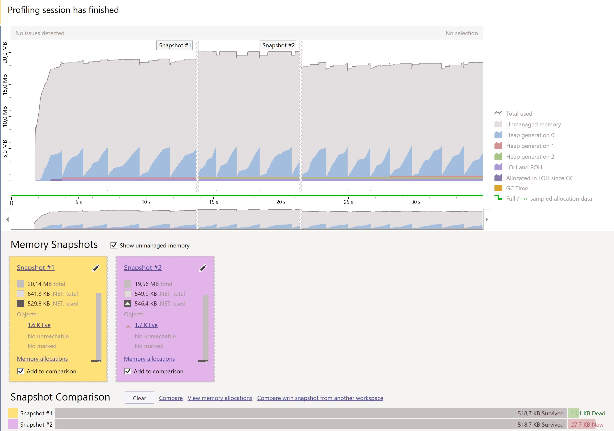


По результатам профайлинга видно, что затраченная оперативная память во время работы сложного сценария не превышает 20 Мб. Видна цикличность выполнения сценария и что не образуется утечек памяти при переходе от итерации к итерации цикла. Большая часть памяти расходуется на массивы байтов, которыми записываются и считываются данные файлов. Профилировщик подсказывает, что существуют строки-дубликаты, от которых можно попробовать избавиться, чтобы уменьшить нагрузку на память. Также значительное место занимает словарь, который я использую для хранения оригинальной локации забэкпленного файла. Возможно данное решение является не совсем удачным.

### dotTrace
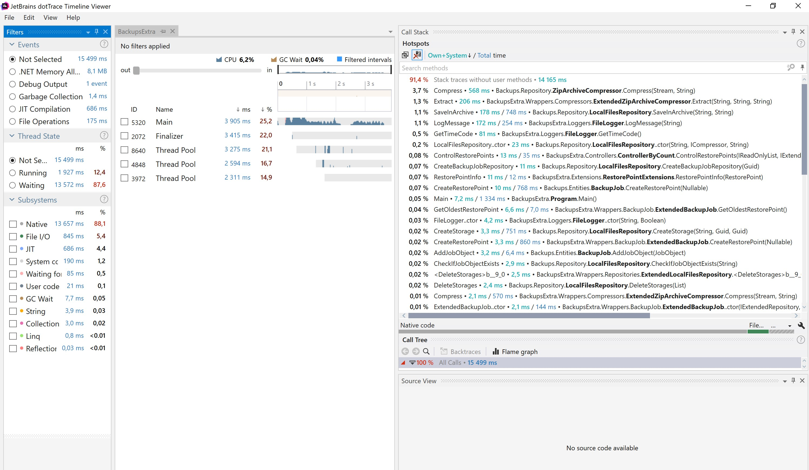
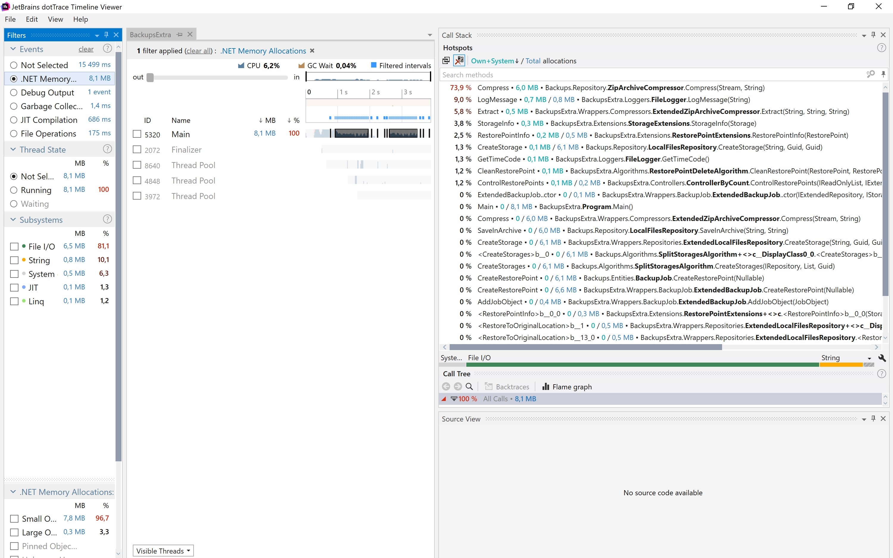
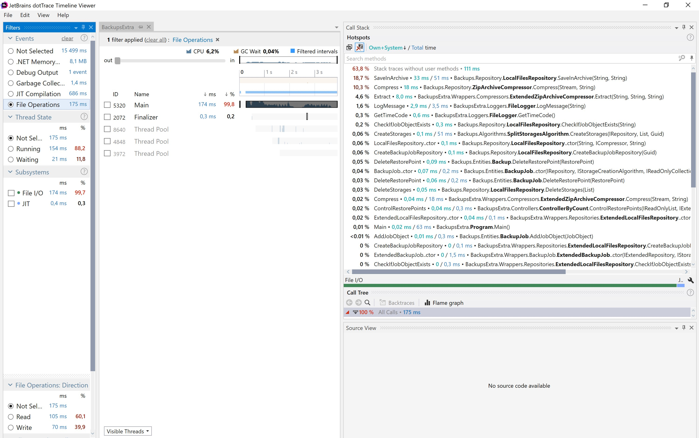
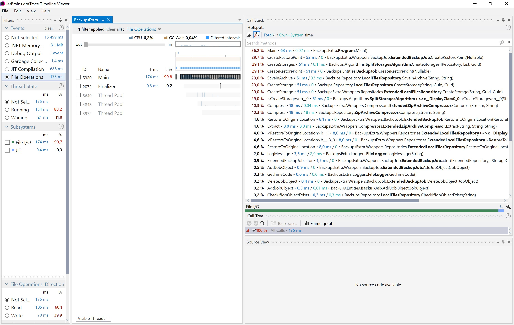

Профилировщик показал, что узкими горлышками при работе бэкапов являются операции сжатия данных в zip архив, а также чтение и запись файлов. Возможно, данные алгоритмы можно оптимизировать, но в целом ничего критичного не обнаружил.

---
## Результаты работы для in memory хранилища

### dotMemory
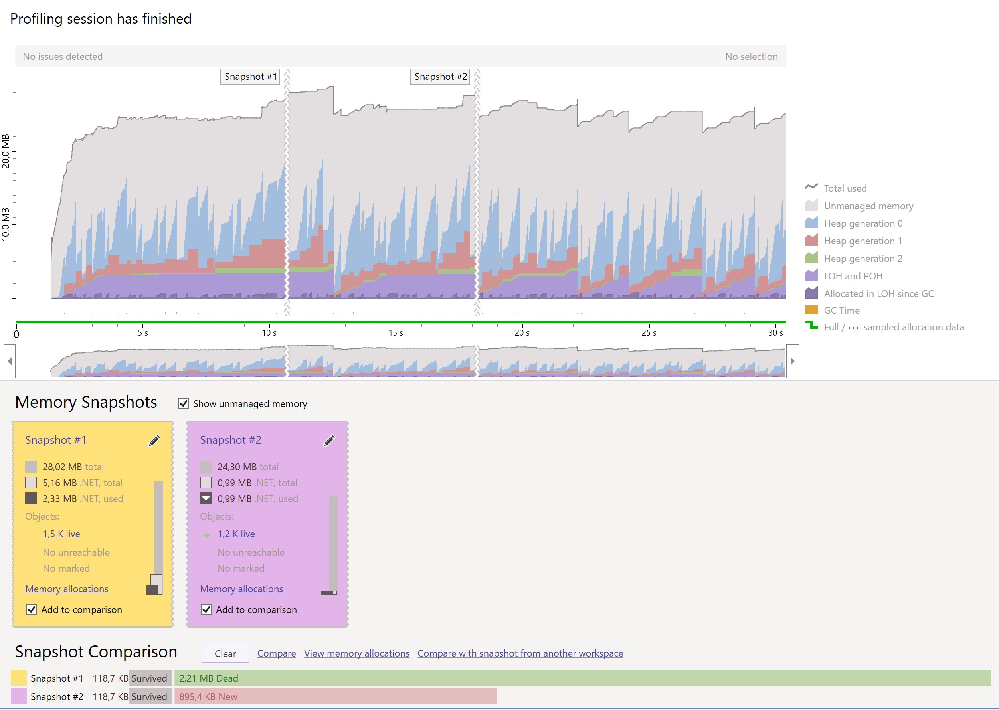
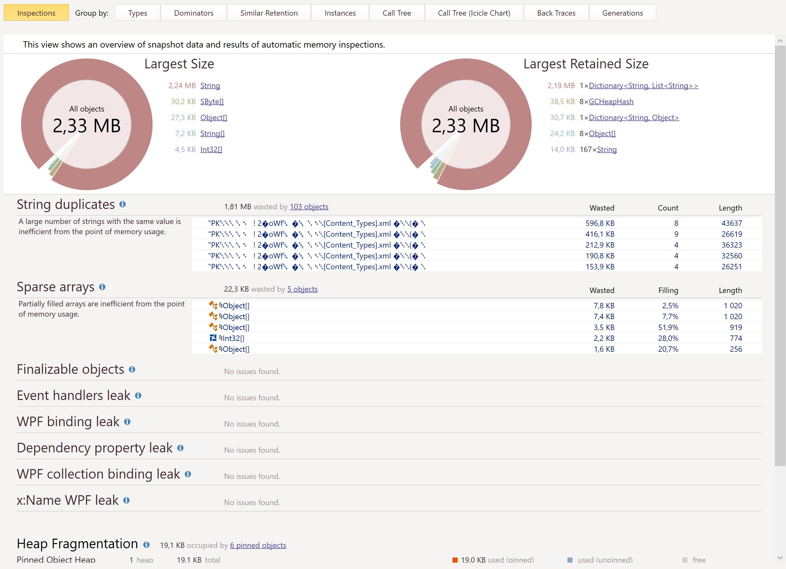

По результатам профайлинга видно, что затрачивается больше памяти, чем при работе с файловой системой, что оправдано тем, что содержимое бэкапных файлов хранится в словаре. Видна цикличность выполнения сценария и что не образуется утечек памяти при переходе от итерации к итерации цикла. Большая часть памяти расходуется на строки, которые хранят данные файлов в словаре, где ключ - путь к файлу в абстрактном хранилище и значение - содержимое файла.

### dotTrace
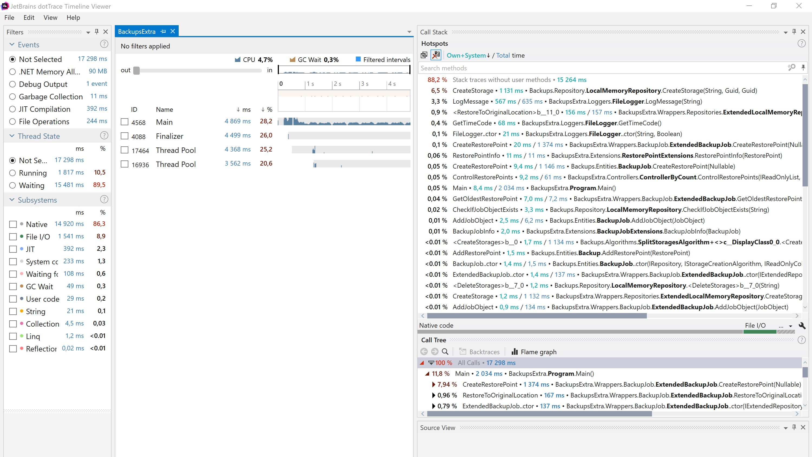
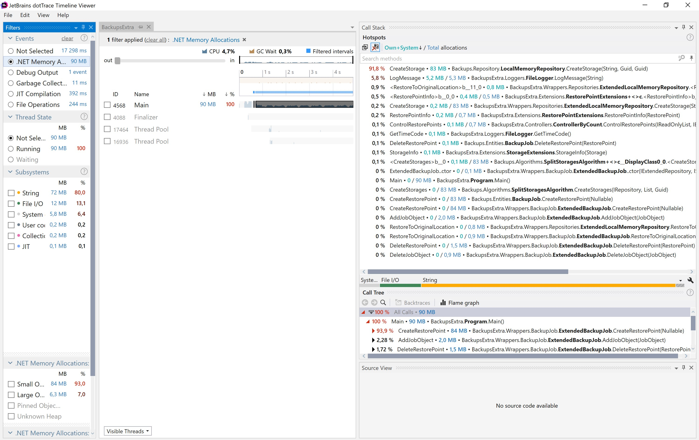
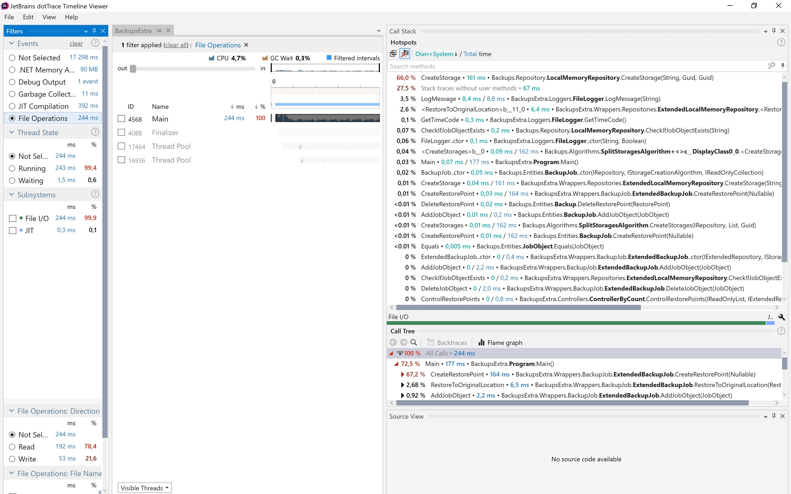
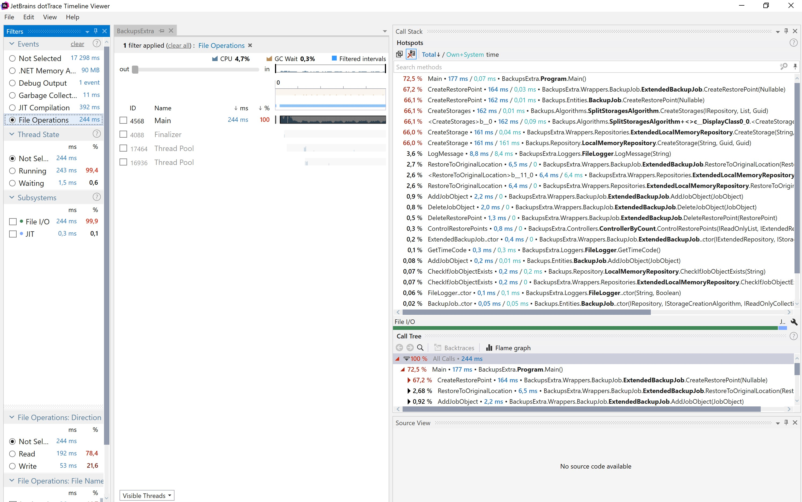

Профилировщик показал, что процесс создания строраджей и рестор поинтов теперь являются неэффективными, потому что требуют значительно больше процессорного времени и оперативной памяти, что происходит из-за хранения содержимого немаленьких файлов, а также множественных операций над словарем-хранилищем. Возможно, хранилище in memory стоит оптимизировать, однако оно в основном используется для тестов работы бэкапов, и его оптимизация не является крайне необходимой.