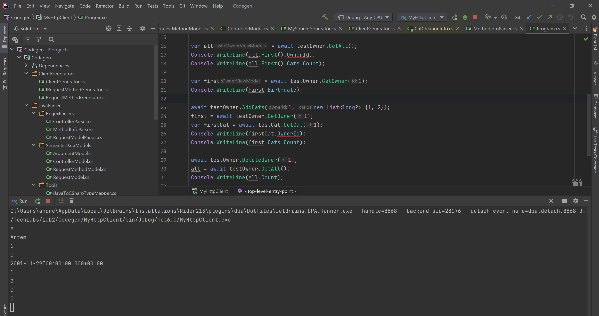

# Отчёт по лабораторной работе №2

Ссылка на код: https://github.com/is-tech-y24-1/JabaJabila/tree/main/Lab2

## Java Server

Напишем простой http сервер на Java с REST API контроллерами, GET, POST, PUT, DELETE запросами.

Пример контроллера:

```java
@RestController
@RequestMapping("owner")
public class OwnerController {

    @Autowired
    private OwnerService ownerService;

    @Autowired
    private CatService catService;

    @PostMapping(path = "create-owner",
            consumes = {MediaType.APPLICATION_JSON_VALUE},
            produces = {MediaType.APPLICATION_JSON_VALUE})
    public ResponseEntity<OwnerViewModel> CreateOwner(@RequestBody OwnerCreationInfo ownerInfo) {
        try {
            Owner owner = ownerService.createOwner(ownerInfo.getName(), ownerInfo.getBirthdate());
            return new ResponseEntity(OwnerViewModel.CreateFromEntity(owner), HttpStatus.OK);
        } catch (Exception e) {
            return ResponseEntity.status(HttpStatus.BAD_REQUEST).body(null);
        }
    }

    @GetMapping("all")
    public ResponseEntity<List<OwnerViewModel>> getAll() {
        try {
            List<OwnerViewModel> ownerViews = new ArrayList<>();
            for (Owner owner: ownerService.getAllOwners()) {
                ownerViews.add(OwnerViewModel.CreateFromEntity(owner));
            }
            return new ResponseEntity(ownerViews, HttpStatus.OK);
        } catch (Exception e) {
            return ResponseEntity.status(HttpStatus.BAD_REQUEST).body(null);
        }
    }

    @GetMapping("{id}")
    public ResponseEntity<OwnerViewModel> getOwner(@PathVariable Long id) {
        try {
            return new ResponseEntity(OwnerViewModel.CreateFromEntity(ownerService.findOwner(id)), HttpStatus.OK);
        } catch (RuntimeException e) {
            return ResponseEntity.status(HttpStatus.NOT_FOUND).body(null);
        }
    }

    @DeleteMapping("delete")
    public HttpStatus deleteOwner(@RequestParam Long id) {
        try {
            ownerService.deleteOwner(id);
            return HttpStatus.OK;
        } catch (RuntimeException e) {
            return HttpStatus.NOT_FOUND;
        }
    }

    @PostMapping("add/{ownerId}")
    public HttpStatus addCat(@PathVariable Long ownerId, @RequestParam Long catId) {
        try {
            ownerService.addCat(ownerService.findOwner(ownerId), catService.findCat(catId));
            return HttpStatus.OK;
        } catch (RuntimeException e) {
            return HttpStatus.NOT_FOUND;
        }
    }

    @PostMapping("add-many/{ownerId}")
    public HttpStatus addCats(@PathVariable Long ownerId, @RequestParam List<Long> catIds) {
        try {
            List<Cat> cats = new ArrayList<Cat>();
            for (Long id: catIds) {
                cats.add(catService.findCat(id));
            }

            ownerService.addCats(ownerService.findOwner(ownerId), cats);
            return HttpStatus.OK;

        } catch (RuntimeException e) {
            return HttpStatus.NOT_FOUND;
        }
    }
}
```

## Парсер Java

Напишем на C# парсер кода сервера на Java с использованием регулярных выражений и других методов работы со строками, чтобы достать необходимую семантическую информацию о методах контроллеров и о моделях.

### Класс информации о моделях

```cs
public class RequestModel
{
    private readonly List<string> _names;
    private readonly List<string> _types;

    public RequestModel()
    {
        _names = new List<string>();
        _types = new List<string>();
        ModelName = string.Empty;
    }
    
    public string ModelName { get; set; }
    public IReadOnlyCollection<string> PropertyNames => _names;
    public IReadOnlyCollection<string> PropertyTypes => _types;

    public void AddName(string name) => _names.Add(name);
    public void AddType(string type) => _types.Add(type);
}
```

### Класс информации о аргумантах методов

```cs
public class ArgumentModel
{
    public string Name { get; set; }
    public RequestArgumentType RequestType { get; set; }
    public string Type { get; set; }
}
```

### Класс информации о методах контроллеров

```cs
public class RequestMethodModel
{
    private readonly List<ArgumentModel> _args;

    public RequestMethodModel()
    {
        _args = new List<ArgumentModel>();
    }
    
    public string Name { get; set; }
    public string ReturnType { get; set; }
    public RequestType RequestType { get; set; }
    public string Url { get; set; }
    public IReadOnlyCollection<ArgumentModel> Arguments => _args;

    public void AddArgument(ArgumentModel argumentModel) => _args.Add(argumentModel);
}
```

### Класс информации о классе контроллеров

```cs
public class ControllerModel
{
    private readonly List<RequestMethodModel> _methods;

    public ControllerModel()
    {
        _methods = new List<RequestMethodModel>();
    }
    
    public string Name { get; set; }
    public string BaseUrl { get; set; }
    public IReadOnlyCollection<RequestMethodModel> MethodModels => _methods;

    public void AddMethodModel(RequestMethodModel methodModel) => _methods.Add(methodModel);
}
```

## Codegen

С использованием Roslyn API построим по полученной семантике синтаксические деревья необходимых классов и сгенерируем с помощью Source генераторов http клиент, работающий с Java сервером и его моделями. Source генератор генерирует код во время компиляции и встраивает сгенерированные классы прямо в сборку

```cs
[Generator]
public class MySourceGenerator : ISourceGenerator
{
    private readonly string _pathToRequestModels =
        @"D:\TechLabs\Lab2\javaServer\src\main\java\com\JabaJabila\javaServer\models";

    private readonly string _pathToControllers =
        @"D:\TechLabs\Lab2\javaServer\src\main\java\com\JabaJabila\javaServer\controllers";

    private readonly string _baseUrl = "http://localhost:8080";
    
    private IRequestModelGenerator _modelGenerator;
    private IClientGenerator _clientGenerator;

    public void Initialize(GeneratorInitializationContext context)
    {
        var parser = new JavaCodeParser(new ControllerParser(new MethodInfoParser(new JavaToCSharpTypeMapper())),
            new RequestModelParser(new JavaToCSharpTypeMapper()));
        
        _modelGenerator = new RequestModelGenerator(parser);
        _clientGenerator = new ClientGenerator(parser, new RequestMethodGenerator());
    }

    public void Execute(GeneratorExecutionContext context)
    {
        var mainSyntaxTree = context.Compilation.SyntaxTrees
            .First(x => x.HasCompilationUnitRoot);

        var directory = Path.GetDirectoryName(mainSyntaxTree.FilePath);
        var pathToProject = Path.Combine(directory, context.Compilation.AssemblyName);
        
        var models = _modelGenerator.GenerateModels(
            _pathToRequestModels,
            pathToProject,
            context.Compilation.AssemblyName);

        var controllers = _clientGenerator.GenerateClient(
            _pathToControllers,
            pathToProject,
            context.Compilation.AssemblyName,
            _baseUrl);
        
        foreach (var (syntaxTree, name) in models)
            context.AddSource(name, SourceText.From(syntaxTree.ToString(), Encoding.UTF8));
        
        foreach (var (syntaxTree, name) in controllers)
            context.AddSource(name, SourceText.From(syntaxTree.ToString(), Encoding.UTF8));
    }
}
```

### Пример сгенерированной модели:

```cs
namespace MyHttpClient.GeneratedModels;
public class CatCreationInfo
{
    public CatCreationInfo(string name, string breed, string birthdate)
    {
        Name = name;
        Breed = breed;
        Birthdate = birthdate;
    }

    public string Name { get; set; }

    public string Breed { get; set; }

    public string Birthdate { get; set; }
}
```

### Пример сгенерированного класса клиента:

```cs
using System.Net.Http.Json;
using System.Text.Json;
using System.Web;
using MyHttpClient.GeneratedModels;

namespace MyHttpClient.GeneratedClient;
public class CatController
{
    private readonly HttpClient _httpClient = new HttpClient();
    private readonly JsonSerializerOptions _serializerOptions = new JsonSerializerOptions{PropertyNameCaseInsensitive = true};
    public async Task<CatViewModel> CreateCat(CatCreationInfo catInfo)
    {
        var query = string.Empty;
        var content = JsonContent.Create(catInfo);
        var response = await _httpClient.PostAsync($"http://localhost:8080/cat/create-cat" + $"?{query}", content);
        return JsonSerializer.Deserialize<CatViewModel>(await response.Content.ReadAsStringAsync(), _serializerOptions) ?? throw new InvalidOperationException("Request returned null");
    }

    public async Task<List<CatViewModel>> GetAll()
    {
        var query = string.Empty;
        var response = await _httpClient.GetAsync($"http://localhost:8080/cat/all" + $"?{query}");
        return JsonSerializer.Deserialize<List<CatViewModel>>(await response.Content.ReadAsStringAsync(), _serializerOptions) ?? throw new InvalidOperationException("Request returned null");
    }

    public async Task<CatViewModel> GetCat(long? id)
    {
        var query = string.Empty;
        var response = await _httpClient.GetAsync($"http://localhost:8080/cat/{id}" + $"?{query}");
        return JsonSerializer.Deserialize<CatViewModel>(await response.Content.ReadAsStringAsync(), _serializerOptions) ?? throw new InvalidOperationException("Request returned null");
    }

    public async Task DeleteCat(long? id)
    {
        var query = HttpUtility.ParseQueryString(string.Empty);
        query["id"] = string.Join(',', id);
        var response = await _httpClient.DeleteAsync($"http://localhost:8080/cat/delete" + $"?{query}");
    }
}
```

Теперь мы можем работать с http клиентом как будто мы его написали своими руками:

```cs
using MyHttpClient.GeneratedClient;
using MyHttpClient.GeneratedModels;

var testOwner = new OwnerController();
var testCat = new CatController();

await testCat.CreateCat(new CatCreationInfo("a", "b", "2020-01-10"));
await testCat.CreateCat(new CatCreationInfo("b", "c", "2021-02-11"));

var cats = await testCat.GetAll();
Console.WriteLine(cats.First().Name);

var res= await testOwner.CreateOwner(new OwnerCreationInfo("Artem", "2001-11-29"));
Console.WriteLine(res.Name);

var all = await testOwner.GetAll();
Console.WriteLine(all.First().OwnerId);
Console.WriteLine(all.First().Cats.Count);

var first = await testOwner.GetOwner(1);
Console.WriteLine(first.Birthdate);

await testOwner.AddCats(1, new List<long?> {1, 2});
first = await testOwner.GetOwner(1);
var firstCat = await testCat.GetCat(1);
Console.WriteLine(firstCat.OwnerId);
Console.WriteLine(first.Cats.Count);

await testOwner.DeleteOwner(1);
all = await testOwner.GetAll();
Console.WriteLine(all.Count);

var allCat = await testCat.GetAll();
Console.WriteLine(allCat.Count);
```

### Результат работы:

