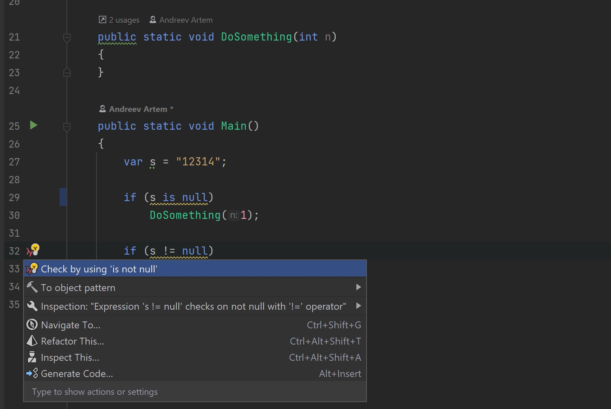
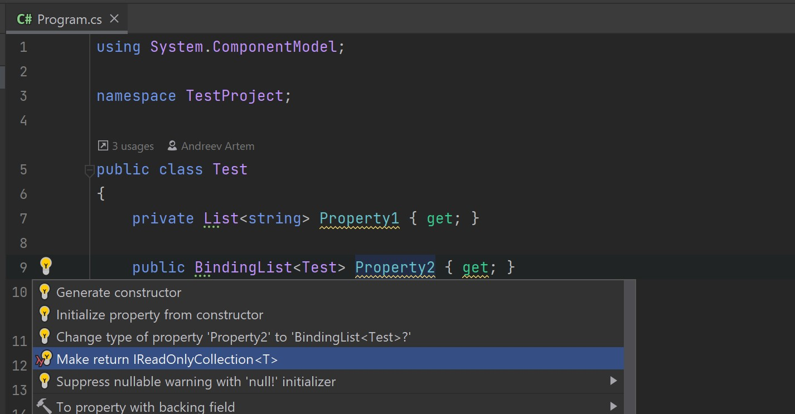
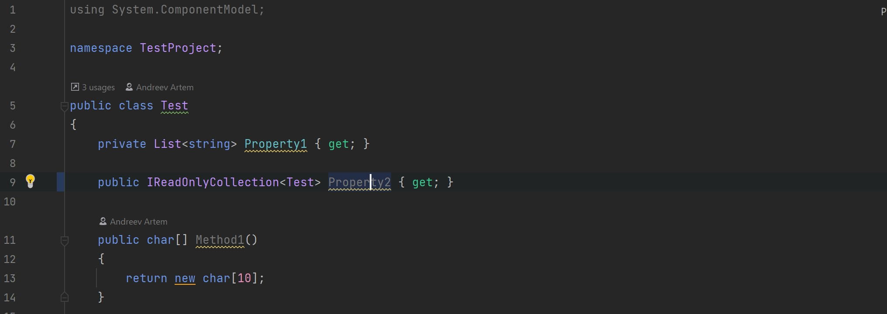
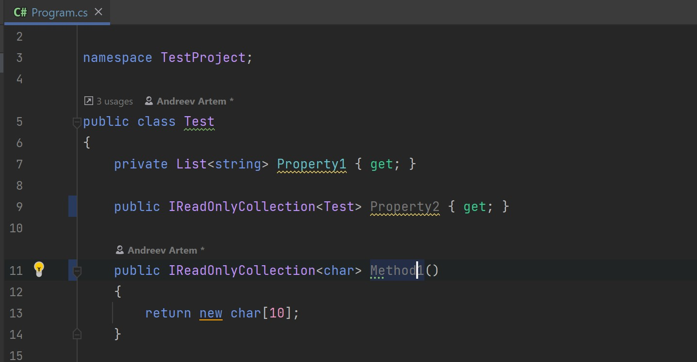

# Отчёт по лабораторной работе №3

Весь код с модульными тестами: https://github.com/is-tech-y24-1/JabaJabila/tree/main/Lab3

## Вариант И1

Для проверки на null использовать конструкции is null и is not null вместо == null и != null.

### Реализация анализатора

```cs
public override void Initialize(AnalysisContext context)
        {
            context.ConfigureGeneratedCodeAnalysis(GeneratedCodeAnalysisFlags.Analyze | GeneratedCodeAnalysisFlags.ReportDiagnostics);
            context.EnableConcurrentExecution();
            context.RegisterSyntaxNodeAction(Analyze,SyntaxKind.EqualsExpression);
        }

        private static void Analyze(SyntaxNodeAnalysisContext context)
        {
            var node = context.Node;
            if (!(node is BinaryExpressionSyntax equalsNode &&
                equalsNode.OperatorToken.IsKind(SyntaxKind.EqualsEqualsToken) &&
                (equalsNode.Right.IsKind(SyntaxKind.NullLiteralExpression) || equalsNode.Left.IsKind(SyntaxKind.NullLiteralExpression))))
                return;
            
            var diagnostic = Diagnostic.Create(Rule, node.GetLocation(), node.ToString());
            context.ReportDiagnostic(diagnostic);
        }
```

```cs
public override void Initialize(AnalysisContext context)
        {
            context.ConfigureGeneratedCodeAnalysis(GeneratedCodeAnalysisFlags.Analyze | GeneratedCodeAnalysisFlags.ReportDiagnostics);
            context.EnableConcurrentExecution();
            context.RegisterSyntaxNodeAction(Analyze, SyntaxKind.NotEqualsExpression);
        }

        private static void Analyze(SyntaxNodeAnalysisContext context)
        {
            var node = context.Node;
            if (!(node is BinaryExpressionSyntax notEqualsNode &&
                notEqualsNode.OperatorToken.IsKind(SyntaxKind.ExclamationEqualsToken) &&
                (notEqualsNode.Right.IsKind(SyntaxKind.NullLiteralExpression) || notEqualsNode.Left.IsKind(SyntaxKind.NullLiteralExpression)))) return;

            var diagnostic = Diagnostic.Create(Rule, node.GetLocation(), node.ToString());
            context.ReportDiagnostic(diagnostic);
        }
```

### Реализация кодфиксера

```cs
public sealed override async Task RegisterCodeFixesAsync(CodeFixContext context)
        {
            var root = await context.Document.GetSyntaxRootAsync(context.CancellationToken).ConfigureAwait(false);
            var diagnostic = context.Diagnostics.First();
            var diagnosticSpan = diagnostic.Location.SourceSpan;
            var declaration = root.FindNode(diagnosticSpan).AncestorsAndSelf().OfType<BinaryExpressionSyntax>().First();

            context.RegisterCodeFix(
                CodeAction.Create(
                    CodeFixResources.JABA0001Fix,
                    c => MakeIsNull(context.Document, declaration),
                    nameof(CodeFixResources.JABA0001Fix)),
                diagnostic);
        }

        private static Task<Solution> MakeIsNull(Document document, BinaryExpressionSyntax binExpr)
        {
            var right = binExpr.Right;
            var left = binExpr.Left;
            ExpressionSyntax nullExpr, notNullExpr;
            (nullExpr, notNullExpr) = right.IsKind(SyntaxKind.NullLiteralExpression) ? (right, left) : (left, right);

            if (!document.TryGetSyntaxRoot(out var root)) return Task.FromResult(document.Project.Solution);
            var editor = new SyntaxEditor(root, document.Project.Solution.Workspace); 
            var isExpr = SyntaxFactory.IsPatternExpression(notNullExpr, SyntaxFactory.ConstantPattern(nullExpr));

            editor.ReplaceNode(binExpr, isExpr);
            return Task.FromResult(document.WithSyntaxRoot(editor.GetChangedRoot()).Project.Solution);
        }
```

```cs
public sealed override async Task RegisterCodeFixesAsync(CodeFixContext context)
        {
            var root = await context.Document.GetSyntaxRootAsync(context.CancellationToken).ConfigureAwait(false);
            var diagnostic = context.Diagnostics.First();
            var diagnosticSpan = diagnostic.Location.SourceSpan;
            var declaration = root.FindNode(diagnosticSpan).AncestorsAndSelf().OfType<BinaryExpressionSyntax>().First();

            context.RegisterCodeFix(
                CodeAction.Create(
                    CodeFixResources.JABA0002Fix,
                    c => MakeIsNotNull(context.Document, declaration),
                    nameof(CodeFixResources.JABA0002Fix)),
                diagnostic);
        }

        private static Task<Solution> MakeIsNotNull(Document document, BinaryExpressionSyntax binExpr)
        {
            var right = binExpr.Right;
            var left = binExpr.Left;
            ExpressionSyntax nullExpr, notNullExpr;
            (nullExpr, notNullExpr) = right.IsKind(SyntaxKind.NullLiteralExpression) ? (right, left) : (left, right);

            if (!document.TryGetSyntaxRoot(out var root)) return Task.FromResult(document.Project.Solution);
            var editor = new SyntaxEditor(root, document.Project.Solution.Workspace);
            var isExpr = SyntaxFactory.IsPatternExpression(
                notNullExpr,
                SyntaxFactory.UnaryPattern(SyntaxFactory.Token(SyntaxKind.NotKeyword),
                    SyntaxFactory.ConstantPattern(nullExpr)));

            editor.ReplaceNode(binExpr, isExpr);
            return Task.FromResult(document.WithSyntaxRoot(editor.GetChangedRoot()).Project.Solution);
        }
```

---

## Вариант О1

В сигнатурах свойств и публичных методов использовать IReadOnlyCollection<T> вместо List<T> и Array<T>.

### Реализация анализатора

```cs
public override void Initialize(AnalysisContext context)
        {
            context.ConfigureGeneratedCodeAnalysis(GeneratedCodeAnalysisFlags.Analyze | GeneratedCodeAnalysisFlags.ReportDiagnostics);
            context.EnableConcurrentExecution();
            context.RegisterSymbolAction(Analyze, SymbolKind.Property, SymbolKind.Method);
        }

        private static void Analyze(SymbolAnalysisContext context)
        {
            if (context.Symbol.Kind == SymbolKind.Property)
            {
                var propSymbol = (IPropertySymbol) context.Symbol;
                if (propSymbol.DeclaredAccessibility != Accessibility.Public) return;

                var typeSymbol = propSymbol.Type;
                if (!CheckIfArrayOrList(typeSymbol)) return;
                var diagnostic = Diagnostic.Create(Rule, propSymbol.Locations.First(), "public property " + propSymbol.ToString());
                context.ReportDiagnostic(diagnostic);
            }
            else if (context.Symbol.Kind == SymbolKind.Method)
            {
                var methodSymbol = (IMethodSymbol)context.Symbol;
                if (methodSymbol.DeclaredAccessibility != Accessibility.Public) return;

                var typeSymbol = methodSymbol.ReturnType;
                if (!CheckIfArrayOrList(typeSymbol)) return;
                var diagnostic = Diagnostic.Create(Rule, methodSymbol.Locations.First(), "public method " + methodSymbol.ToString());
                context.ReportDiagnostic(diagnostic);
            }
        }

        private static bool CheckIfArrayOrList(ITypeSymbol typeSymbol) 
        {
            var namedSymbol = typeSymbol is INamedTypeSymbol symbol ? symbol : null;

            if (namedSymbol is null)
            {
                if (typeSymbol.TypeKind != TypeKind.Array) return false;
            }
            else
            {
                if (!typeSymbol.AllInterfaces.Any(i => 
                        Regex.IsMatch(i.ToDisplayString(), ListInterfaceIdentifier))) return false;
            }

            return true;
        }
```

### Реализация кодфиксера

```cs
public sealed override async Task RegisterCodeFixesAsync(CodeFixContext context)
        {
            var root = await context.Document.GetSyntaxRootAsync(context.CancellationToken).ConfigureAwait(false);
            var diagnostic = context.Diagnostics.First();
            var diagnosticSpan = diagnostic.Location.SourceSpan;
            var declaration = root.FindNode(diagnosticSpan);

            context.RegisterCodeFix(
                CodeAction.Create(
                    CodeFixResources.JABA0003Fix,
                    c => MakeReturnIReadOnlyCollection(context.Document, declaration, c),
                    nameof(CodeFixResources.JABA0003Fix)),
                diagnostic);
        }

        private static Task<Solution> MakeReturnIReadOnlyCollection(Document document, SyntaxNode node, CancellationToken cancellationToken)
        {
            var callNode = node.AncestorsAndSelf()
                .First(n => n.IsKind(SyntaxKind.PropertyDeclaration) || n.IsKind(SyntaxKind.MethodDeclaration));

            var collectionIdentifier = SyntaxFactory.Identifier(CollectionType);

            if (!document.TryGetSyntaxRoot(out var root)) return Task.FromResult(document.Project.Solution);
            var editor = new SyntaxEditor(root, document.Project.Solution.Workspace);

            if (callNode.IsKind(SyntaxKind.PropertyDeclaration))
            {
                var propNode = (PropertyDeclarationSyntax) callNode;
                var type = propNode.Type;
                if (type.IsKind(SyntaxKind.ArrayType))
                    ChangeFromArrayToIReadOnlyCollection(editor, type, collectionIdentifier);

                else if (type.IsKind(SyntaxKind.GenericName))
                    ChangeFromIListToIReadOnlyCollection(editor, type, collectionIdentifier);
            }

            else if (callNode.IsKind(SyntaxKind.MethodDeclaration))
            {
                var methodNode = (MethodDeclarationSyntax)callNode;
                var type = methodNode.ReturnType;

                if (type.IsKind(SyntaxKind.ArrayType))
                    ChangeFromArrayToIReadOnlyCollection(editor, type, collectionIdentifier);

                else if (type.IsKind(SyntaxKind.GenericName))
                    ChangeFromIListToIReadOnlyCollection(editor, type, collectionIdentifier);
            }

            return Task.FromResult(document.WithSyntaxRoot(editor.GetChangedRoot()).Project.Solution);
        }

        private static void ChangeFromIListToIReadOnlyCollection(SyntaxEditor editor, TypeSyntax type, SyntaxToken collectionIdentifier)
        {
            var genericName = (GenericNameSyntax)type;
            var elementTypes = genericName.TypeArgumentList;
            var newNode = SyntaxFactory.GenericName(collectionIdentifier, elementTypes);

            editor.ReplaceNode(genericName, newNode);
        }

        private static void ChangeFromArrayToIReadOnlyCollection(SyntaxEditor editor, TypeSyntax type, SyntaxToken collectionIdentifier)
        {
            var arrayType = (ArrayTypeSyntax)type;
            var elementType = arrayType.ElementType;

            var newNode = SyntaxFactory.GenericName(
                collectionIdentifier,
                SyntaxFactory.TypeArgumentList(SyntaxFactory.SeparatedList(new List<TypeSyntax> { elementType })));

            editor.ReplaceNode(arrayType, newNode);
        }
```

---

## Применение написанных анализаторов и кодфиксеров

Создадим новый проект, добавим в него nuget пакет с самописными анализаторами и кодфиксерами и напишем код, в котором будут срабатывать анализаторы. Также проверим работу кодфиксеров:







