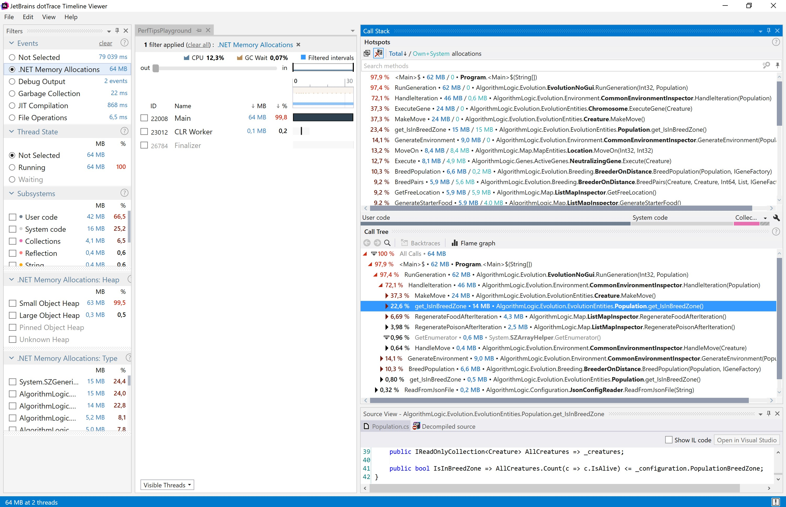

# Отчёт по лабораторной работе №4

## Подготовительный этап

Я реализовал генетический алгоритм, симулирующий эволюционные процессы одноклеточных организмов.
Есть игровое поле X на Y клеток, на нём появляется N существ. Также на карте появляется еда и яд. У каждого существа есть здоровье и набор генов. Когда существо съедает еду, здоровье восполняется, когда съедает яд - умирает. Каждый ген представляет собой объект, реализующий интерфейс IGene и выполняет какой-либо действие над существом с помощью метода  ```void Execute(Creature creature)``` и отнимает очки здоровья. Основные виды действий над существом:
- Шагнуть на 1 клетку в одну из сторон и перейти к выполнению следующего гена
- Съесть содержимое клетки на расстоянии 1 клетки от существа и перейти к выполнению следующего гена
- Превратить яд в еду и перейти к выполнению следующего гена
- Посмотреть на клетку рядом и в зависимости от содержимого перейти к другому гену
- Безусловный переход к другой части генотипа

Итерацией считается выполнение 1 гена у всех живых существ. После каждой итерации количество еды и яда на карте восстанавливаются. Итерации происходят пока не остается M% от начальной популяции. Эти существа прожили больше всего итераций и выиграли в результате естественного отбора. Происходит процесс размножения. Если существа находятся близко друг к другу, то их потомки получают пополам рандомных генов от обоих родителей, иначе существо размножается самоделением. В процессе размножения генотипы потомков мутируют (рандомно изменяются какие-то гены). Поколение на этом завершается, начинаются новые итерации.

Также было написано приложение на WPF, визуализирующее карту после каждой итерации. Обучаясь около 500 поколений я достиг увеличения выживаемости существ с 20-30 итераций, до 200+ итераций.


Ссылка на [реализацию алгоритма](https://github.com/is-tech-y24-1/JabaJabila/tree/main/Lab4): https://github.com/is-tech-y24-1/JabaJabila/tree/main/Lab4

---
## Проверка производительности

Проведём бэнчмарк работы 10 поколений для дальнейшего сравнения написанных оптимизаций.

|         Method | Generations |    Mean |    Error |   StdDev |      Gen 0 | Allocated |
|--------------- |------------ |--------:|---------:|---------:|-----------:|----------:|
| RunGenerations |          10 | 1.272 s | 0.0310 s | 0.0894 s | 11000.0000 |     49 MB |

Также заставим наш алгоритм отработать 100 поколений без графического вывода и посмотрим результаты профилирования через dotTrace и dotMemory.


Работа 100 поколений в цикле заняла 184 секунды и суммарно было аллоцировано 1189 Мб памяти на куче. При этом работа программы требовала в моменте не более 25 Мб оперативной памяти за всё время работы.

Анализ работы алгоритма показал несколько проблемных мест:

1. Узким горлышком оказалось свойство AliveCreatures класса Population, которое при каждом get обращении формировала List живых существ из списка всех сущностей на карте с помощью Linq запроса.

2. На последнем скриншоте видно, что List-ы аллоцируют много памяти во время увеличения capacity при добавлении в List нового объекта.

3. Алгоритм подразумевает существование конечного набора одинаковых генов, которые используется каждым существом, а в алгоритме при генерации генотипа существа создается новый объект гена, в результате чего создаётся много лишних объектов.

4. Создаётся много объектов Location, который представляет из себя точку с 2-мя координатами.

---

## Улучшения производительности

### Проблема №1, 2

Рассмотрим класс Population:

```cs
public class Population
{
    private readonly IPopulationConfiguration _configuration;
    private readonly Creature[] _creatures;

    public Population(
        IPopulationConfiguration populationConfiguration,
        ICreatureConfiguration creatureConfiguration,
        IGeneFactory geneFactory)
    {
        ...
    }
    
    public Population(
        IPopulationConfiguration populationConfiguration, 
        Creature[] creatures)
    {
        ...
    }

    public IReadOnlyCollection<Creature> AllCreatures => _creatures;
    
    public IReadOnlyCollection<Creature> AliveCreatures => _creatures.Where(c => c.IsAlive).ToList();

    public bool IsInBreedZone => AliveCreatures.Count <= _configuration.PopulationBreedZone;
}
```

Свойство AliveCreatures создаёт список живых существ из списка всех существ, а свойство IsInBreedZone также его использует. Данные свойства вызываются довольно часто в коде и происходит много лишних аллокаций временных списков.

Попробуем отказаться от свойства AliveCreatures и пускай во всех местах, где оно вызывалось, будет сделана выборка из всех существ. Также изменим свойство IsInBreedZone

```cs
public IReadOnlyCollection<Creature> AllCreatures => _creatures;

public bool IsInBreedZone => AllCreatures.Count(c => c.IsAlive) <= _configuration.PopulationBreedZone;
```

Проведём анализ:

|         Method | Generations |    Mean |    Error |   StdDev |      Gen 0 | Allocated |
|--------------- |------------ |--------:|---------:|---------:|-----------:|----------:|
| RunGenerations (old) |          10 | 1.272 s | 0.0310 s | 0.0894 s | 11000.0000 |     49 MB |
| RunGenerations (less linq) |          10 | 1.449 s | 0.1516 s | 0.4471 s | 1000.0000 |     10 MB |


Заметны значительные улучшения. Первые 2 выявленные проблемы были решены. Однако было обнаружено новое узкое горлышко - .ToArray() метод у коллекции IGene.

### Проблема №3

Поскольку создаётся множество одинаковых объектов генов, было принято решение заменить фабрику генов на GenePool.

```cs
public class GeneCreator : IGeneFactory
{
    private static readonly Random Random;
    private static readonly int[] Codes
        = { 10,11,12,13,14,15,16,17,20,21,22,23,24,25,26,27,30,31,32,33,34,35,36,37,40,41,42,43,44,45,46,47,50,51,52,53,54,55,56,57 };
    
    static GeneCreator()
    {
        ...
    }
    
    public IGene CreateRandomGene()
    {
        ...
    }

    public IGene CreateGeneFromCode(int code)
    {
        return (code / 10) switch
        {
            1 => new WalkingGene(code % 10),
            2 => new EatingGene(code % 10),
            3 => new NeutralizingGene(code % 10),
            4 => new UnconditionalTransitionGene(code % 10),
            5 => new ConditionalTransitionGene(code % 10),
            _ => throw new GeneticAlgoException($"Gene with code {code} doesn't exist"),
        };
    }

    private static int GetRandomCode()
    {
        return  Codes[Random.Next(0, Codes.Length)];
    }
}
```

```cs
public class GenePool : IGeneFactory
{
    private static readonly Random Random;
    private static readonly int[] Codes
        = { 10,11,12,13,14,15,16,17,20,21,22,23,24,25,26,27,30,31,32,33,34,35,36,37,40,41,42,43,44,45,46,47,50,51,52,53,54,55,56,57 };

    private static readonly Dictionary<int, IGene> Genes;

    static GenePool()
    {
        Random = new Random((int) DateTime.Now.Ticks & 0x0000FFFF);

        Genes = new Dictionary<int, IGene>();
        foreach (var code in Codes)
        {
            Genes[code] = (code / 10) switch
            {
                1 => new WalkingGene(code % 10),
                2 => new EatingGene(code % 10),
                3 => new NeutralizingGene(code % 10),
                4 => new UnconditionalTransitionGene(code % 10),
                5 => new ConditionalTransitionGene(code % 10),
                _ => throw new GeneticAlgoException($"Gene with code {code} doesn't exist"),
            };
        }
    }
    
    public IGene CreateRandomGene()
    {
        return CreateGeneFromCode(GetRandomCode());
    }

    public IGene CreateGeneFromCode(int code)
    {
        return Genes[code];
    }

    private static int GetRandomCode()
    {
        return  Codes[Random.Next(0, Codes.Length)];
    }
}
```

Снова проведём измерения:

|         Method | Generations |    Mean |    Error |   StdDev |      Gen 0 | Allocated |
|--------------- |------------ |--------:|---------:|---------:|-----------:|----------:|
| RunGenerations (old) |          10 | 1.272 s | 0.0310 s | 0.0894 s | 11000.0000 |     49 MB |
| RunGenerations (less linq) |          10 | 1.449 s | 0.1516 s | 0.4471 s | 1000.0000 |     10 MB |
| RunGenerations (GenePool) |          10 | 1.457 s | 0.1613 s | 0.4731 s | 2000.0000 |     10 MB |


Бэнчмарк не показал улучшений, а trace под большей нагрузкой показал меньше аллокаций.

### Проблема №4

Попробуем заменить class Location на readonly struct. Тогда (по идее) мы сможем ещё сильнее снизить аллокации.

|         Method | Generations |    Mean |    Error |   StdDev |      Gen 0 | Allocated |
|--------------- |------------ |--------:|---------:|---------:|-----------:|----------:|
| RunGenerations (old) |          10 | 1.272 s | 0.0310 s | 0.0894 s | 11000.0000 |     49 MB |
| RunGenerations (less linq) |          10 | 1.449 s | 0.1516 s | 0.4471 s | 1000.0000 |     10 MB |
| RunGenerations (GenePool) |          10 | 1.457 s | 0.1613 s | 0.4731 s | 2000.0000 |     10 MB |
| RunGenerations |          10 | 3.104 s | 0.3037 s | 0.8907 s | 561000.0000 |      2 GB |

Затея оказалось очень неудачной и что-то пошло не так. Происходит много запаковок Location и больше времени тратится на их копирование. Откажемся от данного изменения.

### Ещё проблемы

Была обнаружена проблема - частый вызов ToArray() после взаимодействия со свойством Genotype у Chromosome. Изменим возвращаемы1 тип у свойства с IReadOnlyCollection<IGene> на IGene[] и уберём лишние вызовы ToArray().

|         Method | Generations |    Mean |    Error |   StdDev |      Gen 0 | Allocated |
|--------------- |------------ |--------:|---------:|---------:|-----------:|----------:|
| RunGenerations (old) |          10 | 1.272 s | 0.0310 s | 0.0894 s | 11000.0000 |     49 MB |
| RunGenerations (less linq) |          10 | 1.449 s | 0.1516 s | 0.4471 s | 1000.0000 |     10 MB |
| RunGenerations (GenePool) |          10 | 1.457 s | 0.1613 s | 0.4731 s | 2000.0000 |     10 MB |
| RunGenerations (less ToArray()) |          10 | 1.093 s | 0.0217 s | 0.0503 s | 1000.0000 |      7 MB |


Заметны улучшения по аллокациям.

Также заметил что лишние аллокации приходятся на метод Contains у класса Location у метода GetFreeLocaion(). Перепишем его.
Также уберём логирование прогресса на консоль.

```cs
public Location GetFreeLocation()
    {
        if (_entities.Count >= _totalSpace * MaxPlaceAvailable)
            throw new GeneticAlgoException("Too few free space available on map");
        
        var x = Random.Next(0, _configuration.MapWidth);
        var y = Random.Next(0, _configuration.MapHeight);
        var freeLocation = new Location(x, y);

        while (_entities.Select(e => e.Location).Contains(freeLocation))
        {
            x = Random.Next(0, _configuration.MapWidth);
            y = Random.Next(0, _configuration.MapHeight);
            freeLocation = new Location(x, y);
        }

        return freeLocation;
    }
```

Заменим на:

```cs
public Location GetFreeLocation()
    {
        if (_entities.Count >= _totalSpace * MaxPlaceAvailable)
            throw new GeneticAlgoException("Too few free space available on map");
        
        var x = Random.Next(0, _configuration.MapWidth);
        var y = Random.Next(0, _configuration.MapHeight);

        while (_entities.Any(e => e is CreatureEntity c && c.Location.X == x && c.Location.Y == y))
        {
            x = Random.Next(0, _configuration.MapWidth);
            y = Random.Next(0, _configuration.MapHeight);
        }

        return new Location(x, y);
    }
```

|         Method | Generations |    Mean |    Error |   StdDev |      Gen 0 | Allocated |
|--------------- |------------ |--------:|---------:|---------:|-----------:|----------:|
| RunGenerations (old) |          10 | 1.272 s | 0.0310 s | 0.0894 s | 11000.0000 |     49 MB |
| RunGenerations (less linq) |          10 | 1.449 s | 0.1516 s | 0.4471 s | 1000.0000 |     10 MB |
| RunGenerations (GenePool) |          10 | 1.457 s | 0.1613 s | 0.4731 s | 2000.0000 |     10 MB |
| RunGenerations (less ToArray()) |          10 | 1.093 s | 0.0217 s | 0.0503 s | 1000.0000 |      7 MB |
| RunGenerations (no logging + no contains) |          10 | 753.9 ms | 16.71 ms | 47.42 ms | 2000.0000 |      8 MB |




### Итоги

Проведя ряд оптимизаций (как удачных, так и нет) удалось улучшить производительность: увеличить скорость работы с 184 секунд до 20-50 секунд, уменьшить аллокации с 1189 Мб до 40-90 Мб для обучения 100 поколений со 100 существами на карте 64 на 64. Плавающие значения результатов обусловлены рандомом (обучение при каждом новом запуске идет по разному, и если повезло, существа за 100 операций обучатся сильнее и будут жить больше итераций).

Конечно же есть еще небольшие моменты, где можно немного улучшить результаты, но основные проблемы производительности уже решены.
